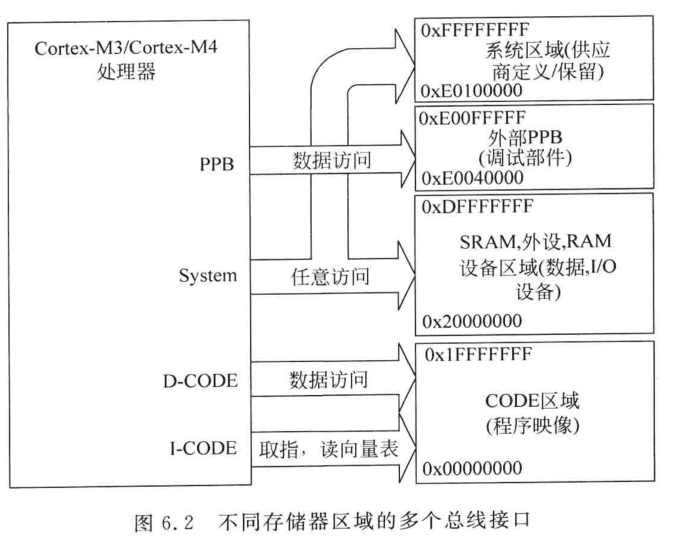
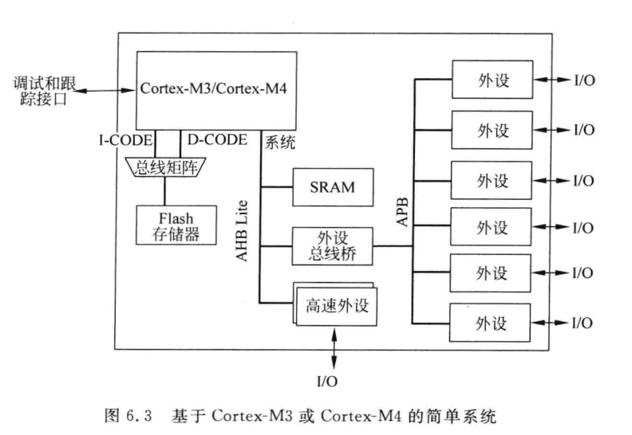
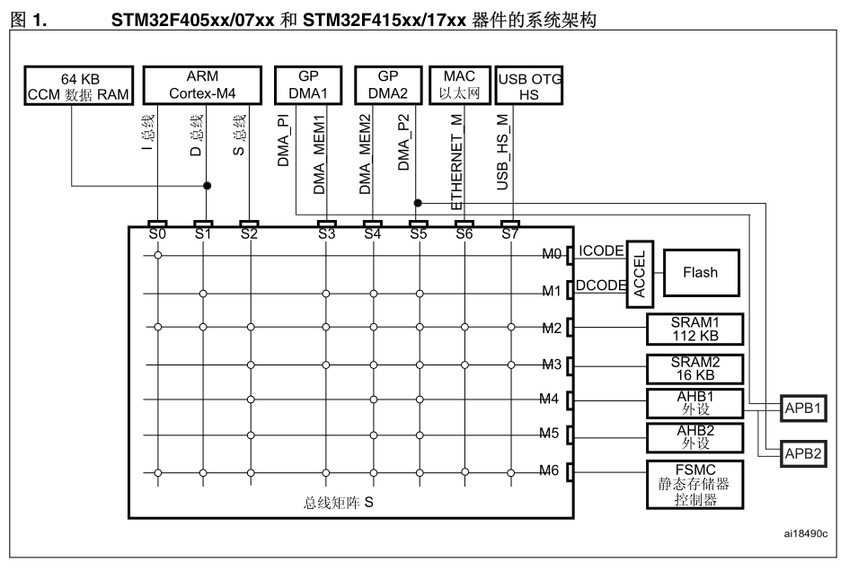
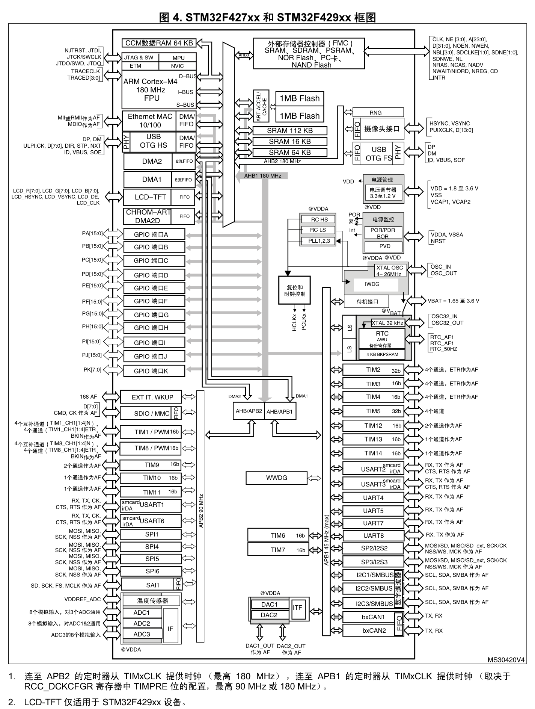
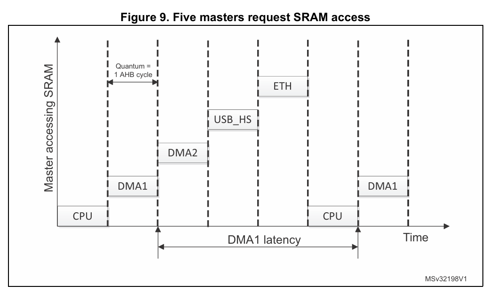
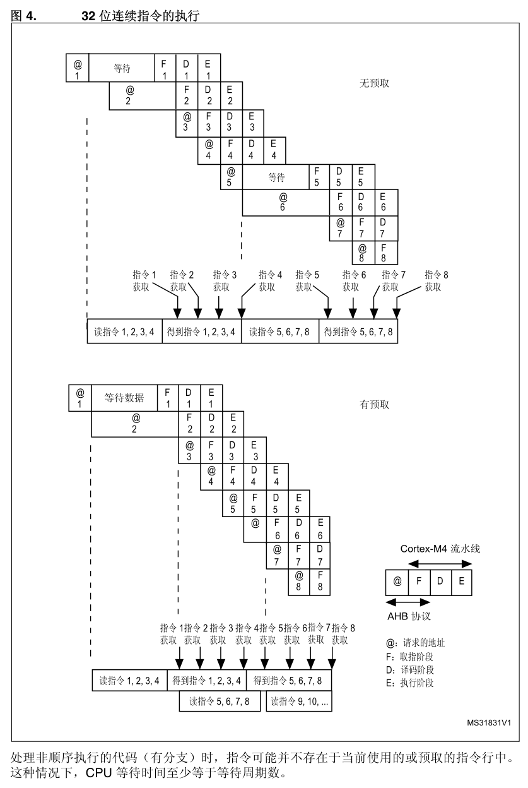
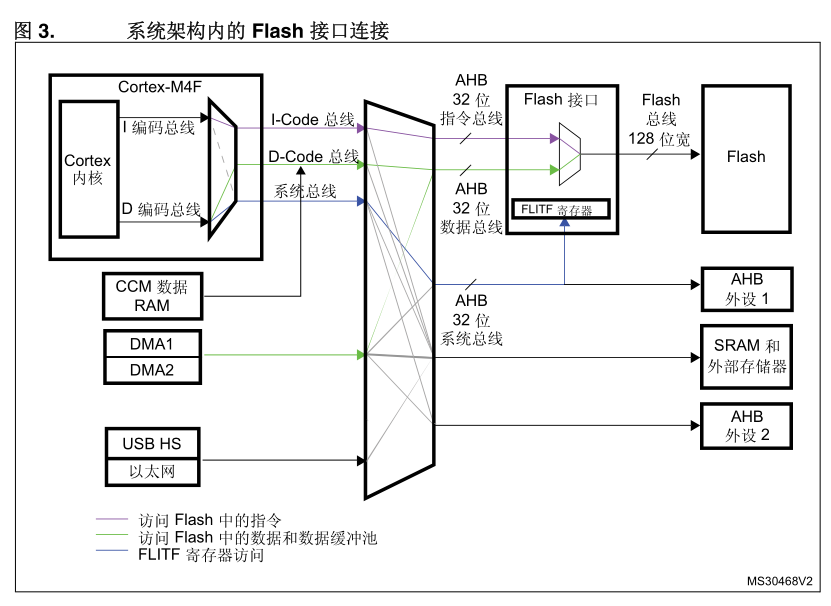

# STM32F4 总线架构：Cortex-M4、AHB 与 APB

<!--
Author: Yuyc2099
Source-Repository: https://github.com/Yuyc2099/Yuyc2099.github.io
Source-ID: yuyc2099:bus-matrix:2026-06-23
-->

## 1. 前言

本文以 **STM32F4 系列常见的 Cortex-M4 系统架构**为主线，解释内核总线接口、片上 Bus Matrix、Flash 访问、DMA，以及 AHB 与 APB 之间的关系。

需要先区分两个层级：

- **Cortex-M4 内核定义**：ICode、DCode、System 等接口，以及地址空间如何路由到这些接口。
- **STM32F4 芯片实现**：Bus Matrix 拓扑、Flash 加速器、DMA 路径、SRAM 分区与外设挂载位置。

STM32F4 包含多个子系列，它们的主设备数量、SRAM 分区、DMA 能力和时钟树并不完全相同。本文描述共同原理；涉及具体路径、寄存器或最坏延迟时，应以所用芯片的 Reference Manual 为准。

> **M0/M3 差异：** Cortex-M0 使用单一 AHB-Lite 接口，取指和数据访问不具备 M3/M4 的三接口结构；Cortex-M3 与 M4 都具有 ICode、DCode 和 System 接口。M4 相比 M3 主要增加 DSP 指令和可选 FPU，总线接口基本一致。

## 2. 从 Cortex-M4 接口到 STM32F4 总线矩阵

### 2.1 Cortex-M4 的四类接口

Cortex-M4 对外提供三个 32-bit AHB-Lite 接口，并为内核私有外设提供 PPB 接口：

| 接口 | 主要用途 | 典型地址区域 |
|------|----------|--------------|
| ICode | Code 区取指、位于 Code 区的向量读取 | `0x00000000~0x1FFFFFFF` |
| DCode | Code 区的数据读取、literal load、调试访问 | `0x00000000~0x1FFFFFFF` |
| System | SRAM、外设、外部存储器访问，以及从这些区域取指 | `0x20000000~0xDFFFFFFF`、部分高地址区域 |
| PPB | NVIC、SysTick、SCB、调试组件等内核私有外设 | `0xE0000000` 附近的 PPB 区域 |

ICode 和 DCode 虽然访问相同的 Code 地址区，却是两条独立接口：取指通常走 ICode，程序读取 Flash 中的常量通常走 DCode。访问 SRAM 或普通外设时，则使用 System 接口。



接口由访问地址和访问类型决定，不是由编译器直接“选择总线”。链接脚本通过决定代码和数据的地址，间接决定最终使用哪条接口。

> **M0/M3 差异：** M0 没有独立的 ICode 和 DCode，因此不能直接套用“I-Code 与 D-Code 并行访问”的分析；M3 与 M4 在这一点上基本相同。

### 2.2 Bus Matrix 属于芯片实现

Cortex-M4 提供接口，但不规定 MCU 必须采用哪一种片上互联。STM32F4 通常使用多层 AHB Bus Matrix，把多个主设备连接到多个从设备。



上图展示的是 Cortex-M3/M4 系统的通用组织方式，用于说明 ICode、DCode、System、AHB-Lite、APB 和外设总线桥之间的层次关系，并不是某一款 STM32F4 的精确内部框图。具体 STM32F4 还会加入 DMA 等总线主设备，并通过多层 Bus Matrix 连接 Flash、SRAM、AHB 外设和 AHB-to-APB Bridge。

下面是 STM32F405xx/407xx 和 STM32F415xx/417xx 的实际系统架构。图中的 S0～S7 是 Bus Matrix 接收各总线主设备请求的从端口，M0～M6 是通向 Flash、SRAM、AHB 外设和 FSMC 等从设备的主端口；交点表示对应主从端口之间存在可用路径。



STM32F427xx/429xx 的系统总框图进一步展示了 Bus Matrix 在整颗芯片中的位置：Cortex-M4 的 I-BUS、D-BUS 和 S-BUS，经片上互联连接 ART、Flash、SRAM、FMC、DMA、AHB 外设及 AHB-to-APB Bridge；APB1、APB2 外设以及时钟、电源和复位模块则位于更外层。该图用于建立全局视角，其中 LCD-TFT 仅适用于 STM32F429xx。



Bus Matrix 的价值是：多个主设备访问**不同从设备**时，可以并发传输。例如 CPU 从 Flash 取指，同时 DMA 向某块 SRAM 写数据，两条路径可能并行。

如果多个主设备同时请求**同一个从设备**，对应的仲裁器必须决定先后顺序。并发能力因此取决于完整路径，而不能只看“CPU 和 DMA 是否同时工作”。

## 3. AHB-Lite 访问与仲裁

### 3.1 AHB-Lite 的基本传输

AHB-Lite 把地址/控制相位与数据相位分开，连续传输时可以形成流水：

```text
周期             1              2              3
地址相位       地址 A          地址 B          地址 C
数据相位         -             数据 A          数据 B
```

当目标尚未完成当前传输时，可以通过 `HREADY` 延长传输；错误响应通过 `HRESP` 返回。等待主要阻塞发起该访问的主设备路径，不代表整颗芯片上的所有主设备都必须停下。

### 3.2 谁决定优先级

AHB-Lite 接口本身不替 STM32F4 规定 CPU、DMA 和其他主设备的全局优先级。仲裁策略由芯片内部的 Bus Matrix、Bridge 和 DMA 控制器分别实现。

需要区分三层仲裁：

1. **DMA 控制器内部优先级**：决定同一 DMA 控制器内多个 stream/request 的服务顺序，通常可由软件配置。
2. **Bus Matrix 仲裁**：决定 CPU、DMA 等主设备竞争同一个从设备时的先后，通常不能通过 HAL 的 DMA priority 配置改变。
3. **AHB-to-APB Bridge 仲裁**：决定 Bus Matrix 公共路径与 DMA direct path 汇聚到同一个 Bridge 后的执行顺序。

对于本文图示的 STM32F4，Bus Matrix 使用 round-robin。它可以理解为在每个从设备方向分别维护一个轮转状态：

1. **访问不同从设备时**：请求走不同路径，不需要由同一个仲裁器决定先后。
2. **当前 AHB 事务已经开始时**：后来请求不能中途抢占；若从设备拉低 `HREADY`，当前事务继续占用该路径。
3. **事务边界仍有多个请求等待时**：仲裁器从上一次获准者之后继续轮询，不固定让 CPU 或 DMA 优先。
4. **只有一个请求时**：该请求直接获得访问权；双方持续竞争时则轮换机会，避免一方长期饥饿。

例如 CPU 与 DMA1 持续竞争 SRAM1：如果上一笔由 CPU 完成，下一次两者都在等待时通常轮到 DMA1，随后再轮到 CPU。AN4031 给出的标称 round-robin quantum 是一笔 AHB transfer。但 DMA burst，以及 CPU 的多寄存器访问或异常压栈等不可分割序列，可能让当前主设备连续保持若干个 AHB 周期的访问权；`HREADY` 等待还会延长当前 transfer。因此，其他主设备的实际等待时间可能明显超过一个 HCLK 周期。



上图是 AN4031 给出的五主设备竞争示例。CPU、DMA1、DMA2、USB_HS 和 Ethernet 同时请求同一个 SRAM 从设备时，Bus Matrix 逐笔授予访问权；DMA1 完成一次访问后，其他仍在等待的主设备依次得到机会，随后才再次轮到 DMA1。因此，DMA1 再次获得 SRAM 访问权之前的延迟，等于排在它前面的其他待处理事务耗时之和。

图中所有请求都按单次、无等待传输绘制，所以每个授权时隙表现为一个 AHB cycle，并标出了 `Quantum = 1 AHB cycle`。实际延迟应按前方主设备尚未完成的不可分割传输序列和等待周期计算。

### 3.3 竞争发生在哪里

| 同时发生的访问 | 是否一定竞争 | 原因 |
|----------------|--------------|------|
| CPU 从 Flash 取指，DMA 写 SRAM | 不一定 | 目标从设备不同，可能并行 |
| CPU 与 DMA 同时访问同一 SRAM | 会产生仲裁 | 请求汇聚到同一个 SRAM 从端口 |
| ICode 取指与 DCode 读取 Flash 常量 | 可能竞争 | 最终都需要 Flash 接口服务 |
| 两个 DMA stream 使用同一 DMA 控制器 | 可能竞争 | 先经过 DMA 内部仲裁，还可能继续竞争总线 |
| CPU 与 DMA 同时访问 APB | 取决于 Bridge 路径 | APB 事务最终需要由 Bridge 串行执行 |

“使用了 DMA”不等于“CPU 一定更快”。DMA 可以释放 CPU 指令执行时间，但仍然消耗存储器、Bridge 和总线带宽。

因此，一次访问的耗时可以粗略理解为：

```text
Access latency
    ≈ Target service time
    + Bus/Bridge transfer time
    + Arbitration waiting time
```

最终耗时取决于完整路径中最慢的一环，不能只根据 CPU、AHB 或 APB 的标称频率判断。

## 4. Flash 取指、常量访问与 ART

### 4.1 ICode 和 DCode 如何共享 Flash

程序通常位于 Flash 的 Code 区：

- CPU 取指使用 ICode。
- 读取 Flash 中的 `const`、字符串或 literal pool，通常使用 DCode。
- 向量表位于 Code 区时，异常向量读取使用 ICode；向量表重定位到 SRAM 后，读取改走 System 接口。

ICode 和 DCode 是独立接口，但它们可能汇聚到同一个 Flash 存储系统。两者是否真正并行、谁先完成、需要多少等待周期，取决于 STM32F4 的 Flash 接口和加速机制。

### 4.2 ART 是 STM32F4 的实现，不是 M4 内核缓存

Cortex-M4 内核本身没有架构级 L1 I-Cache/D-Cache。STM32F4 在 Flash 前加入 ART Accelerator，通过宽 Flash 读取、预取和分支相关的缓存机制降低取指等待。

典型 STM32F4 的 Flash 接口一次可取得较宽的指令行，因此不能把“Flash 配置为 5 wait states”简单理解成“每执行一条指令都等待 5 个 CPU 周期”。顺序代码、跳转代码、常量读取和缓存命中的表现都不同。



图中 `@`、`F`、`D`、`E` 分别表示地址请求、取指、译码和执行。关闭预取时，处理器用完当前指令行后才等待下一行返回；开启预取后，Flash 可以在流水线执行当前指令行的同时读取后续指令行，从而掩盖顺序代码中的大部分等待时间。如果发生分支，且目标指令不在当前指令行或已预取的指令行中，处理器仍需等待目标指令行从 Flash 返回，等待时间可能至少达到所配置的 Flash wait states。

> **M0/M3 差异：** M0 和 M3 内核同样不自带 Cortex-M7 那样的 L1 Cache。具体 MCU 是否具有 Flash Prefetch、厂商缓存或其他加速器，与采用 M0、M3 还是 M4 不能直接画等号。

### 4.3 DMA 访问 Flash 时

当某个 DMA 路径支持从 Flash 读取数据时，DMA 与 CPU 取指可能共享 Flash 带宽。影响大小取决于：

- DMA 是否连续请求以及传输宽度、burst/FIFO 配置。
- CPU 的取指和常量读取是否命中 Flash 加速器。
- Flash、SRAM 和 DMA 在该芯片上的实际连接路径。
- 是否还有其他主设备同时访问相同目标。

因此不能使用“中断延迟 = Flash wait state + DMA burst 剩余时间”这样的固定公式。对实时路径，应在目标芯片、目标频率和真实 DMA 负载下测量。

### 4.4 常见优化方向

| 方法 | 可能收益 | 需要注意 |
|------|----------|----------|
| 正确配置 Flash latency 与加速器 | 降低常见取指等待 | 必须符合电压和频率条件 |
| 把 DMA 源数据放到 DMA 可访问的 SRAM | 避免 DMA 读取 Flash | 占用 SRAM，并可能转为 SRAM 竞争 |
| 把时间敏感函数放入可执行 SRAM | 避免从 Flash 取指 | 取指改走 System 接口，可能与 DMA 竞争 SRAM |
| 让高带宽任务使用不同 SRAM 从设备 | 增加并发机会 | 取决于具体芯片的 SRAM 分区和连接 |
| 调整 DMA stream、FIFO 和 burst | 平衡延迟与吞吐量 | 需要结合外设实时要求 |

把代码放入 SRAM 并不是只加一个属性就能完成：链接脚本需要设置运行地址和加载地址，启动代码还要把函数从 Flash 复制到目标 SRAM。

```c
__attribute__((section(".ramfunc")))
void time_critical_handler(void) {
    /* 链接脚本和启动复制逻辑必须同时配置 */
}
```

如果目标是让关键中断执行期间完全不访问 Flash，其直接或间接调用的函数、literal 常量和跳转表也需要一起放入可执行 SRAM。



图中的 CCM Data RAM 只直接连接 Cortex-M4 的 D-bus，没有连接 ICode，并且不属于主 Bus Matrix。因此，内核无法从 CCM 取指，DMA 也无法访问它。

Cortex-M4 从 Code 区取指时使用 ICode，而这些 STM32F4 的系统互联没有提供从 ICode 到 CCM Data RAM 的访问路径。因此，即使链接器能够把函数字节放入 CCM，内核也无法从中取指执行；`.ramfunc` 应放入可执行的 SRAM1/2/3。这个限制来自具体 STM32F4 的总线连接方式，不是 Cortex-M4 架构对所有 CCM 的统一规定。

## 5. AHB 与 APB 如何协同

### 5.1 APB 本身没有多主仲裁

APB 面向低带宽、低功耗寄存器外设。对 APB 协议来说，Bridge 是主接口，选中的外设是从接口，一次执行一笔事务。

标准 APB 访问至少包含两个 PCLK 周期：

```text
PCLK edge      T0            T1            T2
               |             |             |
Phase          |    Setup    |   Access    |
Sample PREADY                              1
Outcome                                    Complete
```

| 信号或动作 | `T0 → T1`：Setup phase | `T1 → T2`：Access phase |
|------------|-------------------------|--------------------------|
| `PSEL` | 置 1，选中目标外设 | 保持为 1 |
| `PENABLE` | 保持为 0 | 置 1，表示进入访问阶段 |
| 地址、方向和写数据 | 在 T0 后建立 | 整个阶段保持稳定 |
| `PREADY` | 不用于判定完成 | 在 T2 边沿采样；为 1 时传输完成 |
| `PRDATA` | 尚不采样 | 读传输完成时在 T2 边沿采样 |

如果 T2 边沿采样到 `PREADY = 0`，Access phase 不会结束，所有控制信号继续保持，直到某个后续 PCLK 边沿采样到 `PREADY = 1`：

```text
PCLK edge      T0            T1            T2            T3
               |             |             |             |
Phase          |    Setup    |   Access    |   Access    |
Sample PREADY                              0             1
Outcome                                    Wait          Complete
```

图中的 `PCLK edge` 表示 PCLK 有效边沿，`Phase` 表示当前协议阶段，`Sample PREADY` 表示在对应边沿采样到的 `PREADY` 值，`Outcome` 表示采样结果。`Setup` 是建立阶段，`Access` 是访问阶段，`Wait` 表示继续等待，`Complete` 表示本次传输完成。

这里的“两周期”是两个完整的 APB 时钟周期，不能直接写成两个 CPU 周期；实际耗时还要考虑 HCLK/PCLK 比例、Bridge 开销和外设插入的等待周期。

### 5.2 Bridge 上仍可能存在竞争

“APB 协议没有多主仲裁”不等于“STM32F4 的 APB 路径不存在竞争”。以第 2.2 节的 STM32F427xx/429xx 系统总框图为例，CPU 访问 APB1 外设时，请求经 S-BUS 和 Bus Matrix 到达 AHB/APB1 Bridge；DMA1 服务 APB1 外设时，则可以通过图中标出的 DMA1 direct path 到达同一个 Bridge。

```text
CPU S-BUS -> Bus Matrix ------------------+
                                          +-> AHB/APB1 Bridge -> APB1 peripherals
DMA1 peripheral port -> Direct path ------+
```

例如，CPU 正在访问 TIM2，而 DMA1 同时访问 USART2。虽然目标是两个不同的 APB1 外设，但两条访问路径最终汇聚到同一个 AHB/APB1 Bridge，仍需由 Bridge 决定先后并逐笔执行。APB2 侧同理，CPU 与 DMA2 的请求可能在 AHB/APB2 Bridge 汇聚。

ST 的 AN4031 在 AHB-to-APB Bridge 仲裁一节中明确说明，这里的仲裁采用 round-robin，轮询单位是一笔完整的 APB transfer，而不是固定的 CPU 优先级或严格的先来先到队列。可以按下面的规则理解：

1. **Bridge 空闲且只有一个请求时**：该请求直接开始，因此表面上看起来像“先到先执行”。
2. **一笔 APB 事务已经开始时**：后来请求不能抢占，只能等待当前事务完成；`PREADY = 0` 延长 Access phase 时也一样。
3. **事务边界仍有多个请求等待时**：Bridge 根据 round-robin 的当前轮转位置选择下一条路径，不固定让 CPU 或 DMA 优先。
4. **双方持续请求时**：访问机会按事务轮换，避免其中一方长期得不到服务。AN4031 给出的 DMA 外设端口最大附加等待上界是一笔 APB transfer。

Bus Matrix 与 AHB-to-APB Bridge 遵循相同的“事务结束后再轮换”原则，但仲裁范围和轮询单位不同：

| 仲裁位置 | 竞争对象 | 轮询单位 | 何时发生竞争 |
|----------|----------|----------|--------------|
| Bus Matrix | CPU、DMA 等 AHB 主设备 | 一笔 AHB transfer | 多个主设备访问同一个 AHB 从设备 |
| AHB-to-APB Bridge | Bus Matrix 公共路径与 DMA direct path | 一笔 APB transfer | 多条上游路径访问同一个 APB Bridge |

两级仲裁器的轮转状态彼此独立。CPU 访问 APB 外设时，可能先在 Bus Matrix 获得通往 Bridge 的路径，随后还要等待 Bridge；DMA direct path 可以绕过前一级 Bus Matrix 仲裁，但仍需参加 Bridge 仲裁。因此，在 Bus Matrix 获胜不代表能够立即开始 APB 事务。

因此，如果 CPU 已经开始访问 TIM2，随后 DMA1 请求访问 USART2，CPU 会先完成当前事务，DMA1 再获得机会；反过来，如果 Bridge 空闲时只有 DMA1 请求到达，则 DMA1 可以先开始。这里没有中途抢占。还要注意，CPU 请求需先经过 Bus Matrix，而 DMA1 可以走 direct path，所以“软件中谁先发起”并不一定等于“谁先到达 Bridge”。Bus Matrix 和 Bridge 各自执行独立的 round-robin 仲裁。

Bridge 正在完成一笔 APB 事务时，其他请求该 Bridge 的主设备需要等待；与此同时，其他主设备仍可能通过 Bus Matrix 访问 Flash 或 SRAM。

### 5.3 减少不必要的寄存器事务

多个读-改-写操作会产生多次总线访问。对同一普通控制寄存器，可以先在 CPU 寄存器中合并修改，再写回一次：

```c
uint32_t value = USARTx->CR1;
value |= MASK_A | MASK_B | MASK_C;
USARTx->CR1 = value;
```

这通常比连续执行三次 `|=` 少两组总线读写，但必须确认目标寄存器允许普通读-改-写。具有 write-one-to-clear、只写位或并发修改语义的寄存器不能机械套用。

STM32F4 的 GPIO 通常挂在 AHB，而不是 APB，因此不应使用 GPIO 寄存器作为“APB 优化”的示例。

### 5.4 APB 定时器时钟

很多 STM32F4 在 APB prescaler 为 1 时令定时器时钟等于 PCLK；prescaler 不为 1 时，常见规则是定时器时钟为 `2 × PCLK`。部分子系列还提供 TIMPRE 等额外配置，因此计算定时器频率时必须查看具体芯片的 RCC clock tree。

## 6. 程序映像与访问路径

典型程序段在启动前后的状态如下：

| 段 | 加载位置 | 运行期位置 | 典型访问路径 |
|----|----------|------------|--------------|
| `.text` | Flash | Flash | 取指走 ICode |
| `.rodata` | Flash | Flash | 数据读取走 DCode |
| `.data` | Flash 中保存初值 | 启动时复制到 SRAM | Flash 读走 DCode，SRAM 写走 System |
| `.bss` | Flash 不保存内容 | 启动时在 SRAM 清零 | System |
| `.ramfunc` | 通常从 Flash 加载 | 配置正确时在 SRAM 执行 | 取指走 System |

`.bss` 只在镜像中记录地址和大小，不需要从 Flash 搬运初始化内容。

### 6.1 向量表重定位

向量表默认位于地址空间起始位置对应的启动映射区。应用也可以通过 `VTOR` 把向量表重定位到符合对齐要求的其他区域。

- 向量表在 Code 区：向量读取使用 ICode。
- 向量表在 SRAM/System 区：向量读取使用 System 接口。

修改向量项后若立即使能对应异常，应在两者之间执行 `DMB`。切换 `VTOR` 时，通常先屏蔽中断并完成向量表写入，写入 `VTOR` 后执行 `DSB`，再恢复中断；是否额外执行 `ISB` 可按所用启动框架的约定处理。

## 7. 非对齐访问对总线的影响

对内核支持的普通内存非对齐半字或字访问，Cortex-M4 可能将其拆成多次总线传输，因此会增加访问延迟、占用更多总线带宽，并可能加剧与 DMA 等主设备之间的竞争。不能假设一次非对齐半字或字访问只对应一笔 AHB transfer。
