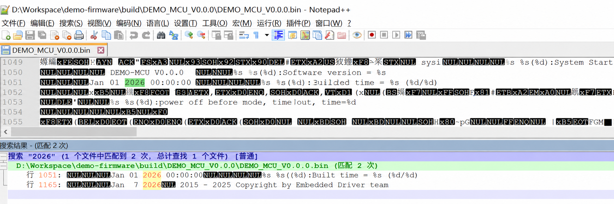
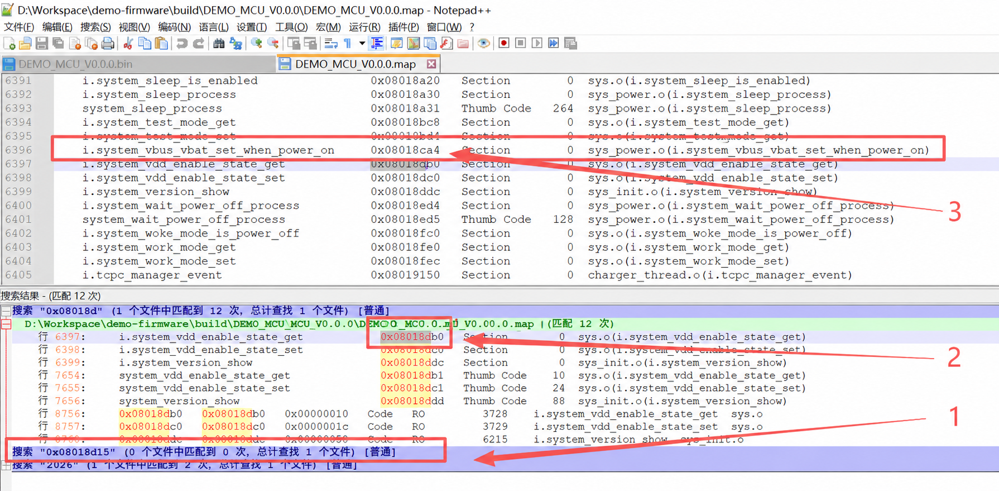
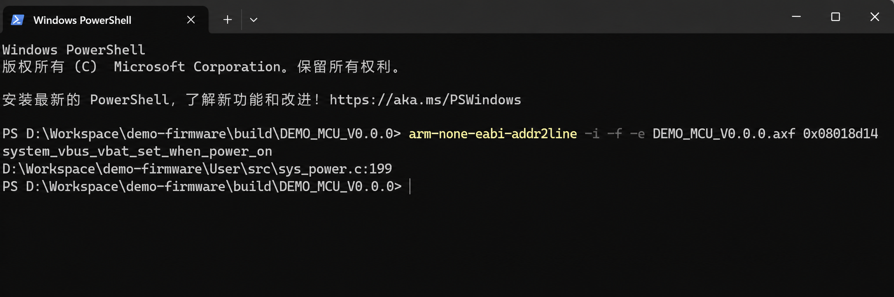

## 1. 方法的用途与边界

嵌入式系统中，系统重启、工作模式切换等关键函数可能有多个调用入口。只记录函数名只能确认“发生了什么”，很难回答“由哪一处代码触发”。一种低成本做法是在目标函数中记录当前返回地址，再结合本次构建生成的 `.map` 和 `.axf` 文件定位调用来源。

需要先明确：**一个返回地址通常只能定位当前函数的直接调用方，不等于完整调用栈**。若要还原多层调用链，需要额外保存栈帧、异常现场，或使用调试器的栈回溯能力。

## 2. 返回地址是怎样产生的

按照 Arm 过程调用标准，`BL`/`BLX` 在跳转到被调函数时，会把顺序执行的下一条指令地址写入链接寄存器 `LR`。对于 Thumb 代码，`LR` 的最低位还用于表示指令集状态，因此日志中的返回地址可能是奇数。

项目中可以把编译器能力封装成统一接口。下面只是一个简化示例，实际条件宏应以所用工具链的文档为准：

```c
#include <stdint.h>

#if defined(__GNUC__) || defined(__clang__)
#define app_return_address() \
    ((uintptr_t)__builtin_return_address(0))
#elif defined(__CC_ARM)
#define app_return_address() \
    ((uintptr_t)__return_address())
#else
#define app_return_address() ((uintptr_t)0)
#endif
```

在目标函数内记录它：

```c
void system_work_mode_set(uint32_t mode)
{
    log_info("set work mode:%lu, return:0x%08lx",
             (unsigned long)mode,
             (unsigned long)app_return_address());

    /* ... */
}
```

这里使用 `uintptr_t` 承载指针整数值。示例面向 32 位 Cortex-M，所以日志仍按 8 位十六进制输出。

### 2.1 使用限制

- 只建议读取第 0 层返回地址。GCC 明确指出，非零层级在部分目标上不可用，甚至可能导致不可预测行为。
- 内联、尾调用优化和链接时优化都可能改变可观察到的调用层级；用于追踪的目标函数应避免被内联。
- 返回地址指向调用后的下一条指令，不是调用指令本身。定位 `BL` 时应在反汇编中向前检查真实指令边界，不要机械地固定减 2 或减 4。
- 中断异常返回使用的 `EXC_RETURN` 与普通函数返回地址不是同一概念，不能直接套用本文流程。

## 3. 准备同一次构建的文件

分析至少需要以下三类材料：

- 包含返回地址的运行日志；
- 链接器生成的 `.map` 文件；
- 带符号和行号信息的 `.axf`/ELF 文件。

`.map` 和 `.axf` **必须来自产生日志中固件的同一次构建**。版本号和编译时间只能作为辅助判断，可靠做法是随发布产物保存构建清单或哈希值。

若版本字符串被编译进 `.bin`，也可以临时搜索该字符串进行交叉确认。这个方法依赖固件确实保留了明文字符串，不能替代构建产物的唯一标识。



## 4. 常用工具

`.axf` 通常是包含 ELF 信息的可执行文件，可用 GNU Binutils 查询：

```bash
# 地址转函数、源文件和行号；-i 展开内联信息
arm-none-eabi-addr2line -i -f -e firmware.axf 0x08018d14

# 反汇编一个地址窗口
arm-none-eabi-objdump -d \
  --start-address=0x08018ca4 \
  --stop-address=0x08018d30 \
  firmware.axf

# 按地址排序查看符号
arm-none-eabi-nm --numeric-sort firmware.axf
```

如果 `addr2line` 只输出 `??:0`，优先检查 AXF 是否来自同一次构建、是否包含调试信息，以及传入的是绝对地址还是节内偏移。

## 5. 完整定位流程

### 5.1 从日志提取原始返回地址

以下日志只保留分析所需字段：

```log
00:00:00.130  Software version = DEMO-MCU V0.0.0
00:00:00.132  Build time = Jan 01 2026 00:00:00
00:00:00.332  set system work mode:1, return:0x08018d15
```

本例的原始返回地址是 `0x08018d15`。

### 5.2 清除 Thumb 状态位

返回地址最低位为 1，先清除状态位，得到用于查表和反汇编的代码地址：

```text
0x08018d15 & ~1 = 0x08018d14
```

这一步只是在地址表示层面清除 Thumb 状态位，并不是“回退到调用指令”。`0x08018d14` 仍是调用结束后将要执行的下一条指令。

### 5.3 在 MAP 中确定所属函数

MAP 文件通常不能直接搜索到函数内部的任意指令地址，需要找到小于等于目标地址且覆盖该地址的代码符号。示例条目为：

```text
system_vbus_vbat_set_when_power_on  0x08018ca5  Thumb Code  196  sys_power.o
```

`0x08018ca5` 的最低位表示 Thumb 状态，实际指令起始地址为 `0x08018ca4`。`196` 是十进制字节数：

```text
196 = 0xC4
函数半开区间 = [0x08018ca4, 0x08018ca4 + 0xC4)
             = [0x08018ca4, 0x08018d68)
```

`0x08018d14` 落在这个区间内，因此可以确认返回点位于 `system_vbus_vbat_set_when_power_on`。



只找“小于且最接近的符号”仍不够严谨，还应检查符号大小或下一个符号的起始地址，确认目标地址确实落在函数范围内。

### 5.4 用 addr2line 定位源码

```bash
arm-none-eabi-addr2line -i -f \
  -e DEMO_MCU_V0.0.0.axf \
  0x08018d14
```

示例输出：

```text
system_vbus_vbat_set_when_power_on
D:\Workspace\demo-firmware\User\src\sys_power.c:199
```



由于输入的是返回点，行号信息可能对应调用语句的下一行。最终确认仍应以反汇编中的调用指令为准。

### 5.5 在反汇编中回看调用指令

示例关键片段：

```asm
08018d0e:  2001       movs  r0, #1
08018d10:  f000 f96c  bl    08018fec <system_work_mode_set>
08018d14:  e7f9       b.n   08018d0a
```

`BL` 位于 `0x08018d10`，下一条指令是 `0x08018d14`；加上 Thumb 状态位后，日志记录为 `0x08018d15`。由此可以确认直接调用关系：

```text
system_vbus_vbat_set_when_power_on
  -> system_work_mode_set(1)
```

如需继续分析触发条件，再从 `BL` 向上检查参数装载、比较和条件分支；不要只凭函数名推断业务路径。

