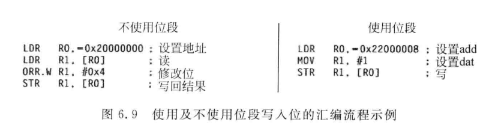
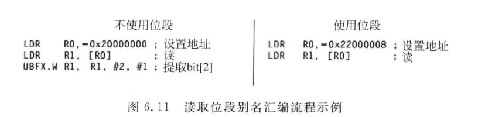

# Cortex-M 位段操作

<!--
Author: Yuyc2099
Source-Repository: https://github.com/Yuyc2099/Yuyc2099.github.io
Source-ID: yuyc2099:cortex-m-bit-band:2026-08-18
-->

## 1. 位段操作的原理

位段操作（Bit-band）把位段区中的每个 bit 映射到一个独立的别名地址。读取别名地址可得到目标 bit 的值，向别名地址写 `0` 或 `1` 可直接清零或置位，无须在软件中执行读—改—写。Cortex-M3/M4 提供 SRAM 和外设位段区；Cortex-M0/M0+ 内核不提供原生位段功能，芯片是否额外实现类似功能应以手册为准。

### 1.1 写入 bit2



### 1.2 读取 bit2



## 2. 位段别名的计算方式

位段区与别名区的地址映射如下：

| 类型 | 位段区（1 MB） | 位段别名区（32 MB） |
|------|----------------|----------------------|
| SRAM | `0x20000000～0x200FFFFF` | `0x22000000～0x23FFFFFF` |
| 外设 | `0x40000000～0x400FFFFF` | `0x42000000～0x43FFFFFF` |

别名地址的计算公式为：

```text
alias_addr = alias_base + (byte_addr - bit_band_base) * 32 + bit_number * 4
```

其中 `bit_number` 为目标字节中的第 `0～7` 位。例如计算 SRAM 地址 `0x20000000` 的 bit2：

```text
alias_addr = 0x22000000 + (0x20000000 - 0x20000000) * 32 + 2 * 4
    = 0x22000008
```

因此，访问 `0x22000008` 就是在访问 `0x20000000` 的 bit2。程序可将公式封装成宏，通过 `volatile uint32_t *` 访问别名地址。

## 3. 位段操作的原子性

### 3.1 普通变量操作中的竞态

普通变量操作中，单次、自然对齐的写入通常不会出现不完整的中间值；多个执行流直接写同一变量时虽然没有读—改—写竞争，但仍存在先后覆盖。若操作包含读取、判断、修改再写回，则不是原子的，会产生竞态。

```c
static volatile uint32_t flags;

void main_task(void)
{
    flags |= 1U << 0;
}

void IRQ_Handler(void)
{
    flags |= 1U << 1;
}
```

若中断发生在主程序读出 `flags` 之后，最终结果可能是 `0x01`，中断写入的 bit1 被覆盖。

### 3.2 位段操作能够解决的问题

位段操作可以原子地置位或清零一个 bit。不同执行流修改同一变量中的不同 bit 时，不需要读—改—写，因此不会相互覆盖。

```c
#define FLAGS_BIT0 (*(volatile uint32_t *)0x22000000U)
#define FLAGS_BIT1 (*(volatile uint32_t *)0x22000004U)

void main_task(void)
{
    FLAGS_BIT0 = 1U;
}

void IRQ_Handler(void)
{
    FLAGS_BIT1 = 1U;
}
```

两个别名地址分别对应 bit0 和 bit1，因此最终结果为 `0x03`。

### 3.3 位段操作不能解决的问题

位段操作不能解决同一 bit 的写入竞争，也不能原子完成翻转、判断后修改或多个 bit 的一致更新。此类操作仍需使用临界区、锁或独占访问指令。

**同一 bit 赋值：**

```c
#define SHARED_BIT (*(volatile uint32_t *)0x22000000U)

void main_task(void)
{
    SHARED_BIT = 1U;
}

void IRQ_Handler(void)
{
    SHARED_BIT = 0U;
}
```

两次写入各自原子，但最终值取决于哪一次最后执行，位段操作不会解决写入冲突。

**先判断再赋值：**

```c
#define LOCK_BIT (*(volatile uint32_t *)0x22000000U)

bool try_lock(void)
{
    if (LOCK_BIT == 0U) {
        LOCK_BIT = 1U;
        return true;
    }

    return false;
}

void main_task(void)
{
    if (try_lock()) {
        /* 主程序进入临界区。 */
    }
}

void IRQ_Handler(void)
{
    if (try_lock()) {
        /* 中断也可能同时进入临界区。 */
    }
}
```

两个执行流可能都在写入前读到 `0`，从而同时返回 `true`。单次读写虽然原子，但“判断后置位”整体并不原子。

## 4. 位段操作示例

下面的宏将位段区地址和位编号转换为别名地址。`addr` 应位于 SRAM 或外设位段区，且不要传入带副作用的表达式。

```c
#define BIT_BAND(addr, bitnum) \
    (((addr) & 0xF0000000U) + 0x02000000U + \
    (((addr) & 0x000FFFFFU) << 5) + ((bitnum) << 2))
#define MEM_ADDR(addr) (*(volatile uint32_t *)(addr))

MEM_ADDR(BIT_BAND(DEVICE_REG_ADDR, 1U)) = 1U;
```

最后一行通过别名地址将 `DEVICE_REG_ADDR` 对应寄存器的 bit1 置为 `1`。
