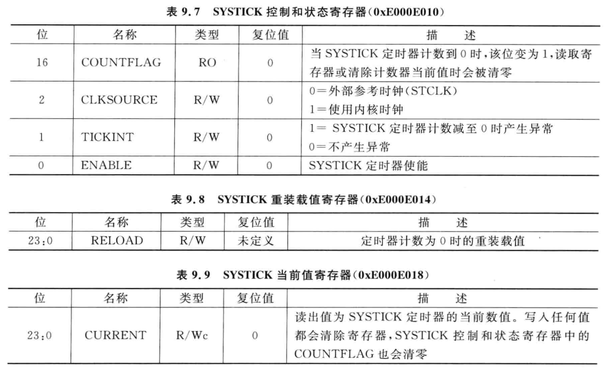
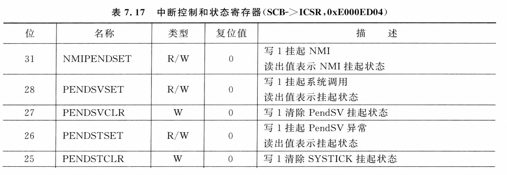

# Cortex-M 异常体系：M0/M0+ 与 M3/M4 对比

<!--
Author: Yuyc2099
Source-Repository: https://github.com/Yuyc2099/Yuyc2099.github.io
Source-ID: yuyc2099:cortex-m-exception-model:2026-08-20
-->

本文对比 Cortex-M0/M0+ 与 Cortex-M3/M4 的异常分类、内核差异及 fault 触发关系，并介绍 PendSV 与 SysTick 的常见用法。

---

## 1. Cortex-M0 / M0+ 异常分类

### 1.1 系统异常

| 编号 | 名称 | 说明 |
|------|------|------|
| 1 | Reset | 复位，固定优先级 -3（最高） |
| 2 | NMI | 不可屏蔽中断，固定优先级 -2 |
| 3 | HardFault | 硬错误，固定优先级 -1 |
| 11 | SVCall | 由 SVC 指令触发的系统服务调用 |
| 14 | PendSV | 可挂起的系统服务，常用于上下文切换 |
| 15 | SysTick | 系统节拍定时器（可选实现） |

### 1.2 外部中断

外部中断从异常编号 16 开始。Cortex-M0/M0+ 最多支持 32 个外部中断，即异常编号 16～47、IRQ0～IRQ31；具体 MCU 可以只实现其中一部分。

### 1.3 M0/M0+ 不具备的独立 fault

相比 M3/M4，M0/M0+ 不提供以下可配置 fault：

- **MemManage Fault**：内存保护和访问权限错误；
- **BusFault**：取指或数据访问时的总线错误；
- **UsageFault**：未定义指令、非法状态等用法错误。

ARMv6-M 的 fault 分类更精简，上述错误不会分别进入三个独立处理程序，而通常表现为 HardFault。

### 1.4 M0 与 M0+ 的差异

M0+ 沿用 M0 的基本异常模型，主要扩展在其他内核能力上：

| 特性 | M0 | M0+ |
|------|----|-----|
| 流水线 | 3 级 | 2 级 |
| MPU | 无 | 可选 8 区域 MPU |
| 指令跟踪 | 无 | 可选 MTB（Micro Trace Buffer） |
| 单周期 I/O | 无 | 支持单周期 I/O 接口 |

即使某个 M0+ 实现了 MPU，ARMv6-M 仍不提供独立的 MemManage、BusFault 和 UsageFault；MPU 访问违规最终由 HardFault 处理。

---

## 2. Cortex-M3 / M4 异常分类

### 2.1 系统异常

| 编号 | 异常名称 | 优先级 | 说明 |
|------|----------|--------|------|
| 1 | Reset | -3（最高） | 复位 |
| 2 | NMI | -2 | 不可屏蔽中断 |
| 3 | HardFault | -1 | 硬错误及其他 fault 的升级入口 |
| 4 | MemManage | 可配置 | 内存管理错误 |
| 5 | BusFault | 可配置 | 总线错误 |
| 6 | UsageFault | 可配置 | 用法错误 |
| 7～10 | 保留 | — | — |
| 11 | SVCall | 可配置 | SVC 指令触发的系统服务调用 |
| 12 | DebugMonitor | 可配置 | 调试监控异常 |
| 13 | 保留 | — | — |
| 14 | PendSV | 可配置 | 可挂起的系统服务 |
| 15 | SysTick | 可配置 | 系统节拍定时器 |
| 16～255 | IRQ0～IRQ239 | 可配置 | 最多 240 个外部中断，具体 MCU 可以实现更少 |

### 2.2 错误类异常详解

#### HardFault（硬错误）

- MemManage、BusFault 或 UsageFault 未使能，或在其处理过程中再次产生不能处理的 fault 时，可能升级为 HardFault；
- 向量表读取失败也会触发 HardFault；
- 可结合 `HFSR.FORCED`、`HFSR.VECTTBL` 和 CFSR 中的子状态位继续判断来源。

#### MemManage Fault（内存管理错误）

- MPU 访问权限违规；
- 执行 XN（Execute Never）区域中的代码；
- 栈越界进入 MPU 保护区。

#### BusFault（总线错误）

- 取指总线错误；
- 数据读写总线错误；
- 外设或存储器返回错误响应；
- 某些指令对未对齐地址的访问无法完成。

精确数据总线错误通常能由栈帧 PC 定位到相关指令；非精确 BusFault 可能延迟上报，此时栈帧 PC 不一定就是实际出错指令。

#### UsageFault（用法错误）

- 执行未定义指令；
- 使用非法的 EXC_RETURN，或发生非法状态切换；
- 整数除以零（使用硬件除法指令且使能 `DIV_0_TRP`）；
- 未对齐访问（使能 `UNALIGN_TRP`，或指令本身要求对齐）；
- 访问未实现或未使能的协处理器。Cortex-M4 的浮点单元是可选项，未实现或未使能时执行相关指令可置位 `NOCP`；Cortex-M3 不带浮点单元。

### 2.3 触发关系概览

```text
MPU 访问违规             -> MemManage Fault
取指或数据总线响应错误   -> BusFault
非法指令或非法状态       -> UsageFault
上述 fault 未使能或升级  -> HardFault
HardFault 处理期间再故障 -> Lockup
```

---

## 3. PRIMASK、FAULTMASK 与 BASEPRI

Cortex-M 通过三个特殊寄存器控制异常屏蔽。屏蔽只阻止处理器响应异常，不会阻止异常进入 pending 状态。

| 寄存器 | 适用内核 | 屏蔽范围 | 常见用途 |
|--------|----------|----------|----------|
| PRIMASK | M0/M0+/M3/M4 | 置 1 后屏蔽所有可配置优先级异常，NMI 和 HardFault 不受影响 | 短临界区、全局关中断 |
| BASEPRI | M3/M4 | 非 0 时屏蔽优先级数值大于或等于阈值的异常，数值越小优先级越高 | 保留高优先级中断的临界区、RTOS |
| FAULTMASK | M3/M4 | 置 1 后除 NMI 外全部屏蔽，包括 HardFault | 保护故障现场，降低二次 fault 再入风险 |

在 fault 处理函数保存关键现场后，可设置 FAULTMASK，在记录转储和受控复位期间阻止其他 fault 处理函数再次进入，避免二次故障破坏现场。但 FAULTMASK 不能修复非法访问，处理函数再次执行错误指令仍可能进入 Lockup。

---

## 4. SysTick 定时与时间测量

SysTick 是 Cortex-M 内核自带的 24 位递减计数器，主要使用 `CTRL`、`LOAD` 和 `VAL` 三个寄存器。注意`VAL`是一个递减计数器，`CALIB`（`0xE000E01C`）提供可选校准信息，但一般没有使用。



### 4.1 周期性中断

STM32 HAL 默认使用 SysTick 维护系统时基，调用关系如下：

```text
HAL_Init()
└─ HAL_InitTick(TICK_INT_PRIORITY)
   └─ HAL_SYSTICK_Config(SystemCoreClock / (1000U / uwTickFreq))
      └─ SysTick_Config(ticks)
```

`HAL_InitTick()` 的核心逻辑是配置周期并设置中断优先级：

```c
__weak HAL_StatusTypeDef HAL_InitTick(uint32_t tick_priority)
{
    uint32_t ticks;

    if ((uwTickFreq == 0U) ||
        (tick_priority >= (1UL << __NVIC_PRIO_BITS))) {
        return HAL_ERROR;
    }

    ticks = SystemCoreClock / (1000U / uwTickFreq);
    if (HAL_SYSTICK_Config(ticks) != 0U) {
        return HAL_ERROR;
    }

    HAL_NVIC_SetPriority(SysTick_IRQn, tick_priority, 0U);
    uwTickPrio = tick_priority;
    return HAL_OK;
}
```

默认 `uwTickFreq` 对应 1 ms 周期，`SysTick_Handler()` 中调用 `HAL_IncTick()` 累加系统节拍。

### 4.2 单次中断

SysTick 计数到 0 后会自动重装。要实现单次中断，应在第一次进入处理函数时关闭计数器。
单次延时的`ticks` 的有效范围为 1～`0x01000000`。该用法会占用 SysTick，不能与 HAL 默认时基同时使用。

### 4.3 微秒级时间测量

HAL 已启动 SysTick 且时钟源为 HCLK 时，可以读取 `VAL` 实现短时间忙等待，无需修改 HAL 的周期配置：

```c
void Delay_us(uint32_t us)
{
    uint32_t target = us * (SystemCoreClock / 1000000U);
    uint32_t period = SysTick->LOAD;
    uint32_t previous = SysTick->VAL;
    uint32_t elapsed = 0U;

    while (elapsed < target) {
        uint32_t current = SysTick->VAL;
        if (previous != current) {
            elapsed += (current < previous ) ? (previous - current) : (period - current + previous);
            previous = current;
        }
    }
}
```

这里使用 `LOAD + 1` 作为完整计数周期，并根据递减计数器是否回绕分别计算差值。该方法适合短延时；长时间或高精度测量应使用通用定时器，M3/M4 芯片若实现了 DWT，也可使用其周期计数器。

---

## 5. PendSV 的使用

PendSV 是可由软件挂起的可编程优先级的系统异常。RTOS 中通常把它设为最低优先级，用于把调度工作推迟到其他中断处理完成之后。

### 5.1 设置 PendSV 异常

向 `SCB->ICSR` 的 `PENDSVSET` 位写 1 可挂起 PendSV，向 `PENDSVCLR` 位写 1 可取消尚未响应的 PendSV：



```c
NVIC_SetPriority(PendSV_IRQn, (1U << __NVIC_PRIO_BITS) - 1U);
SCB->ICSR = SCB_ICSR_PENDSVSET_Msk;

/* 必要时取消尚未响应的 PendSV。 */
SCB->ICSR = SCB_ICSR_PENDSVCLR_Msk;
```

若 PendSV 已挂起，处理器会在没有更高优先级异常需要处理时进入 `PendSV_Handler()`。

### 5.2 RTOS 上下文切换

典型切换过程如下：

```text
SysTick 或外部中断唤醒任务
        -> 请求调度并挂起 PendSV
        -> 高优先级中断处理完成
        -> PendSV 保存当前任务上下文
        -> 切换任务栈指针
        -> 恢复下一任务上下文并异常返回
```

异常入口由硬件保存 `R0～R3`、`R12`、`LR`、`PC` 和 `xPSR`；RTOS 移植层通常再保存 `R4～R11`，切换 PSP 后按相反顺序恢复。使用 FPU 时还需按移植方案处理浮点上下文。

### 5.3 RTOS 为什么使用 PendSV

- **并非唯一选择**：上下文切换并非必须由 PendSV 执行。SysTick 也可以设为最低优先级，并在其处理函数中直接完成任务切换；但 SysTick 本质上是周期定时异常，通常同时承担系统 tick，还容易与 HAL 时基等机制耦合。PendSV 是 Arm 专门设计的可延迟软件异常，将其设为最低优先级并用于上下文切换，可以让 SysTick 只负责时间管理和任务唤醒，从而使时间管理与任务调度解耦；
- **可延迟**：中断只请求调度，实际切换等高优先级中断结束后执行；
- **优先级可配置**：设为最低优先级后，上下文切换不会阻塞紧急中断；
- **硬件支持异常现场**：异常入口和返回自动保存、恢复基础栈帧，移植层只需补齐其余寄存器；
- **请求可合并**：PendSV 已处于 pending 时再次置位不会重复排队，避免连续切换。
