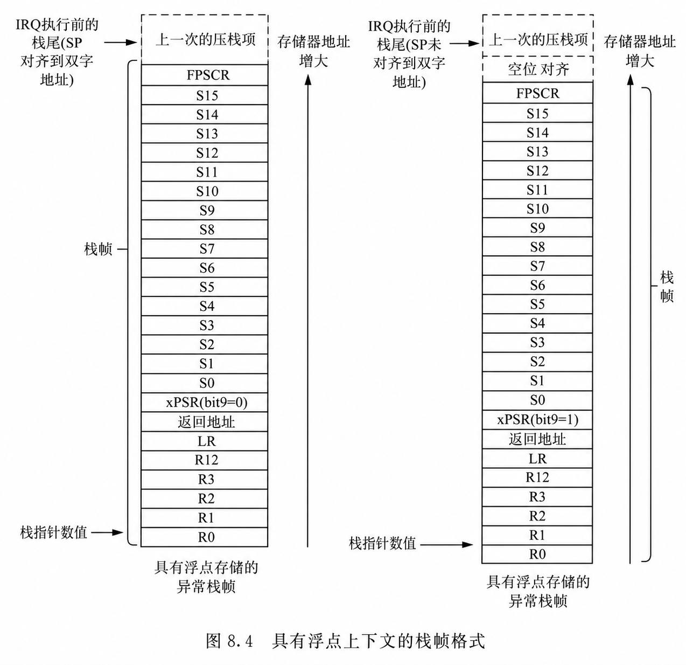
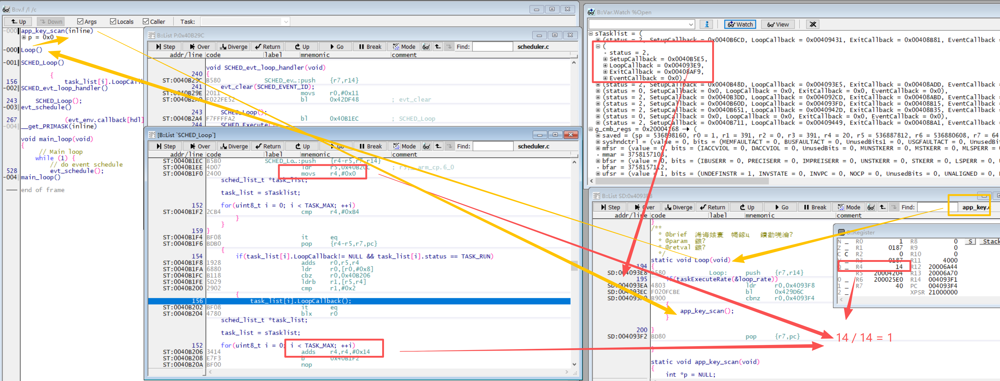

# Cortex-M 异常分析：从栈帧到 HardFault 定位

<!--
Author: Yuyc2099
Source-Repository: https://github.com/Yuyc2099/Yuyc2099.github.io
Source-ID: yuyc2099:cortex-m-fault-analysis:2026-07-06
-->

虽然 M0/M0+ 与 M3/M4 的异常体系不同，但异常入口的基本栈帧和常见软件缺陷具有共通性。本文聚焦异常现场、栈回溯和 HardFault 定位方法。

---

## 1. 异常入口的栈帧处理

### 1.1 硬件自动压栈

发生异常时，Cortex-M 内核在跳转到异常向量前会**自动**将以下寄存器压入当前活动栈（MSP 或 PSP）：

| 偏移 | 寄存器 | 说明 |
|------|--------|------|
| +0x00 | R0 | 参数/返回值寄存器 |
| +0x04 | R1 | 参数寄存器 |
| +0x08 | R2 | 参数寄存器 |
| +0x0C | R3 | 参数寄存器 |
| +0x10 | R12 | 内部调用寄存器（IP） |
| +0x14 | LR | 链接寄存器（返回地址） |
| +0x18 | PC | 出错时的程序计数器 |
| +0x1C | xPSR | 程序状态寄存器（含 IPSR/EPSR/APSR） |

> 基本栈帧包含 8 个寄存器，共 32 字节。为满足 8 字节栈对齐，硬件可能额外加入一个 4 字节填充字，可通过栈中 xPSR 的 bit9 判断。Cortex-M4 使用浮点单元且异常发生时存在活动浮点上下文时，还可能压入扩展浮点栈帧。R4–R11 不在基本硬件栈帧中，其完整性由 AAPCS 调用约定保证——见下节。

### 1.2 R4–R11 的保护机制

R4–R11 被 AAPCS 定义为 callee-saved（被调用者保存）。编译器对**每个 C 函数**（包括 ISR）都遵守同一条规则：**函数内部用到哪些就保存哪些，退出前恢复。**

以 `func1` 执行时被 `ISR2` 打断为例：

```
func1 正在执行：R4=0x10, R5=0x20，其余 R6-R11 也有值
    │
    ↓ 中断触发
    硬件自动压栈 R0–R3, R12, LR, PC, xPSR（与 R4-R11 无关）
    │
    ↓ 跳转到 ISR2
    编译器为 ISR2 生成序言：PUSH {R4, R5}   ← ISR2 自己要用 R4/R5，先保存当前值
    ISR2 执行，R4/R5 被改写为 ISR2 的中间结果
    编译器为 ISR2 生成尾声：POP  {R4, R5}   ← ISR2 退出前恢复成 0x10, 0x20
    │
    ↓ 异常返回
    硬件弹栈恢复 R0–R3, R12, LR, PC, xPSR
    │
func1 继续执行：R4=0x10, R5=0x20，与被打断前完全一致
```

关键点：**ISR2 保存/恢复的是它自己打算覆盖的寄存器，本质上是 ISR2 对自己行为负责，而不是主动替 func1 保护现场。** 结果上 func1 的 R4–R11 得到了保全，但这是 AAPCS 约定的副产品——ISR2 若完全不用 R4–R11，编译器不会生成任何 PUSH/POP，func1 的值同样不会被破坏。

### 1.3 EXC_RETURN 与异常栈帧解析

异常入口会把 LR 设置为 EXC_RETURN。返回方式主要由 bit 2、bit 3 和 bit 4 决定：

| 位 | 为 0 | 为 1 | 作用 |
|----|------|------|------|
| bit 2（SPSEL） | 使用 MSP | 使用 PSP | 选择从哪个栈恢复现场 |
| bit 3（MODE） | 返回 Handler 模式 | 返回 Thread 模式 | 选择异常返回后的处理器模式 |
| bit 4（FTYPE） | 扩展浮点栈帧 | 基本栈帧 | 指示需要恢复的栈帧类型；仅带 FPU 的内核需要关注 |

HardFault 处理首先关注 bit 2，以取得发生异常时使用的栈指针。如果 Cortex-M4 工程启用了浮点单元，解析栈帧前还必须检查 bit 4；它为 0 时，入口 SP 指向的是扩展浮点栈帧。

### 1.4 xPSR bit 9 与栈帧对齐

xPSR 的 bit 9 是栈对齐标志。异常入栈时，如果硬件为了满足 8 字节对齐要求额外插入了一个 4 字节填充字，压栈后的 xPSR bit 9 为 1；没有填充字时为 0。

回溯时，先读取 `stack[7]` 中保存的 xPSR，并根据 bit 9 越过基本栈帧和可选的对齐填充字：

| xPSR bit 9 | 栈帧大小 | 异常发生前的 SP |
|-------------|----------|-----------------|
| 0 | 32 字节 | `SP + 32` |
| 1 | 36 字节 | `SP + 36` |

即先计算 `previous_sp = sp + 32 + (bit9 ? 4 : 0)`。

随后判断 EXC_RETURN bit 4。bit 4 为 1 时表示基本栈帧，无需再调整；bit 4 为 0 时表示存在浮点扩展栈帧，需要在上述结果上再加 72 字节：

`previous_sp += 72`

这 72 字节由 16 个浮点寄存器 S0–S15、1 个 FPSCR 和 1 个保留占位字组成，即 `(16 + 1 + 1) × 4 = 72` 字节。保留占位字使浮点扩展区保持双字大小，它是扩展栈帧的固定组成，与 xPSR bit 9 指示的可选 4 字节对齐填充不是同一项。



### 1.5 M3/M4 附加诊断寄存器

M3/M4 在进入 fault 处理函数后可进一步读取：

- **CFSR**（`0xE000ED28`）：包含 UFSR / BFSR / MMFSR，指示具体错误类型
- **HFSR**（`0xE000ED2C`）：HardFault 状态，是否由其他 fault 升级而来
- **BFAR**（`0xE000ED38`）：触发 BusFault 的访问地址（BFSR.BFARVALID 有效时）
- **MMFAR**（`0xE000ED34`）：触发 MemManage Fault 的地址（MMFSR.MMARVALID 有效时）

> M0/M0+ 不存在上述寄存器，只能依赖栈帧中的 PC 值配合反汇编定位出错位置。

---

## 2. 函数调用的压栈与返回

异常栈帧只记录被打断瞬间的现场。要继续向上还原调用链，还需理解普通函数如何保存返回地址。

以 `func_a` 调用 `func_b` 为例，假设一条 4 字节的 `BL` 位于 `0x08000100`，下一条指令位于 `0x08000104`：

```asm
func_a:
0x08000100  bl   func_b        ; PC = func_b，LR = 0x08000105
0x08000104  ...                ; func_b 返回后从这里继续执行

func_b:
0x08000200  push {r4, r5, lr}  ; 将返回 func_a 的地址压栈
0x08000202  sub  sp, #16       ; 分配局部变量空间
0x08000204  bl   func_c        ; PC = func_c，LR = 0x08000209
0x08000208  ...                ; func_c 返回后从这里继续执行
              add  sp, #16
              pop  {r4, r5, pc}  ; 将栈中的 0x08000105 恢复到 PC
```

`BL` 本身不会修改 SP。执行 `func_b` 的 `PUSH` 和 `SUB SP` 后，栈帧如下；低地址位于上方：

```
Low address
                         +------------------------------+
Current SP ------------->| Local variables (16 bytes)   | <- SUB SP, #16
                         +------------------------------+
                         | Saved R4                     |
                         +------------------------------+
                         | Saved R5                     | <- PUSH {R4, R5, LR}
                         +------------------------------+
                         | Saved LR = 0x08000105        |
SP on entry to func_b -->+------------------------------+
                         | func_a stack frame           |
                         +------------------------------+
High address               Memory address increases down
```

`BL` 同时完成两件事：把目标函数地址写入 PC，使处理器跳转到 `func_b`；把下一条指令地址写入 LR，作为返回地址。Cortex-M 仅支持 Thumb 状态，因此 LR 的 bit 0 为 1；`0x08000105` 恢复到 PC 后，实际从对齐后的 `0x08000104` 继续执行。

---

## 3. CmBacktrace 栈回溯原理

[CmBacktrace](https://github.com/armink/CmBacktrace) 是面向 Cortex-M 的异常栈回溯库，可在不依赖调试器的情况下，通过串口输出异常现场和可能的函数调用路径。

### 3.1 回溯的核心问题

异常发生时，硬件压栈只保存了出错瞬间的 PC，无法直接给出完整调用链。继续回溯时，需要在栈中寻找各级函数保存的 LR，并验证它是否来自一次真实调用。

以前一章的 `func_a` 调用 `func_b` 为例，栈中保存的 LR 为 `0x08000105`：

| 步骤 | 地址 | 含义 |
|------|------|------|
| 读取候选 LR | `0x08000105` | bit 0 为 1，符合 Cortex-M Thumb 返回地址特征 |
| 清除 bit 0 | `0x08000104` | `func_b` 返回后实际继续执行的位置 |
| 检查上一条指令 | `0x08000100` | `0x08000100`–`0x08000103` 是一条 4 字节的 `BL func_b` |

因此，`0x08000105` 不是调用指令本身，而是调用后的返回地址。只有在对齐后的 `0x08000104` 之前找到合法的 `BL`/`BLX` 调用指令，才能把这个栈中数据视为可信的 LR，并据此确认 `func_a → func_b` 这一层调用关系。

### 3.2 使用前提

**1. 正确配置代码段和栈范围**

CmBacktrace 通过扫描栈中的候选返回地址进行回溯，需要知道实际代码段范围、当前栈边界和栈顶位置。代码段不一定固定为整个 `0x08000000` 区域，应以链接脚本和固件布局为准。

**2. 保留同一次构建的 ELF 或 `.map` 文件**

回溯得到的是一组原始地址，需要使用同一次构建的 ELF 配合 `addr2line`，或对照 `.map` 文件转换为函数名和行号。CmBacktrace 的核心机制不是依赖 R11 固定帧指针，而是扫描栈并验证可能的 `BL`/`BLX` 返回地址。

### 3.3 回溯流程

```
1. 异常入口
   ├─ 读取 EXC_RETURN（LR），判断出错前用的是 MSP 还是 PSP
   ├─ 根据基本帧、浮点扩展帧和对齐填充确定现场布局
   └─ 得到：出错 PC、出错前 LR（即调用出错函数的返回地址）

2. 第一帧（出错帧）
   └─ PC → 出错指令地址，对应最底层出错函数

3. 向上回溯每一帧
   ├─ 当前帧的 LR 值 = 上一层函数的返回地址（调用点的下一条指令）
   ├─ 在栈内向高地址扫描，寻找下一个合法 LR 值：
   │    • 地址落在工程配置的代码段范围内
   │    • bit0 = 1（Thumb 指令，Cortex-M 只有 Thumb 模式）
   │    • 对应地址的前一条指令是 BL/BLX（确认是调用点）
   └─ 找到后记录该 LR，继续向上扫描，直到到达栈顶或超出范围

4. 输出结果
   └─ 将收集到的地址序列通过串口打印，格式如：
      fault on thread: main
      addr2line -e firmware.elf -a -f 0x08002abc 0x08001f34 0x08000c12
```

### 3.4 LR 扫描的可靠性边界

cm_backtrace 采用的是**启发式 LR 扫描**，不是基于 DWARF 调试信息的精确展开，因此存在以下局限：

| 情形 | 影响 |
|------|------|
| 函数内联（`-O2` 及以上）| 内联函数不产生 BL 指令，回溯链中会缺少该层 |
| 尾调用优化（`-O2` tailcall）| 编译器用 B 替换 BL，该帧 LR 不入栈，可能丢帧 |
| 栈已被溢出破坏 | LR 值被覆盖，回溯结果不可信 |
| 代码段地址范围配置错误 | 合法 LR 被过滤掉，或误匹配数据中的值 |

因此 cm_backtrace 的结果应作为**辅助定位线索**，结合出错 PC 和 CFSR/BFAR 等寄存器综合判断。

---

## 4. Lauterbach TRACE32 离线死机分析

### 4.1 原理概述

死机分析的本质是：**在设备重启后，用工具在 PC 上重建死机瞬间的完整内存快照**，再由 TRACE32 结合 ELF 符号表还原调用链和变量值。

可按分析需求保存以下区域：

| 区域 | 原因 |
|------|------|
| Stack | 调用链返回地址（LR）和各帧局部变量，是回溯的核心 |
| Heap | 若栈帧中的指针指向堆对象，保存堆后才能还原对象内容 |
| 全局/静态变量区 | 需要分析系统状态、标志位或缓冲区时用于还原上下文 |

栈和异常现场寄存器是调用链分析的核心；若还需要查看堆对象和全局状态，则应同时保存对应 SRAM 区域。直接保存实际使用的 SRAM 地址范围通常最省事，但多 SRAM 区域器件应按链接布局分别处理。

### 4.2 TRACE32 离线分析示例



通过 TRACE32 离线分析可以确认局部变量 `i = 1`，死机位置位于 `app_key_scan` 函数，原因为对空指针 `p` 的非法访问。

### 4.3 注意事项

- **栈溢出场景**：若死机原因本身是栈溢出，栈内 LR 已被覆盖，调用链回溯不可信，只能依赖 PC + CFSR 定位错误类型。
- **关中断保证原子性**：拷贝 SRAM 期间若被中断打断并修改内存，快照将不一致，分析结果失真。

---

## 5. 常见软件缺陷

> 本节只对常见软件缺陷作简要介绍，暂不讨论 RTOS 的任务栈、任务切换、ISR API、断言和系统钩子等 OS 相关问题。各类缺陷的复现方法、寄存器分析和调试案例后续单独整理。

软件缺陷与异常类型并不是固定的一一对应关系。错误访问如果落在有效的 SRAM、Flash 或外设地址范围内，可能不会立即触发 fault，而是先破坏数据，之后才在其他位置表现为异常。

### 5.1 野指针、空指针和悬空指针

指针未初始化、指向已经失效的对象，或被错误运算后指向非法地址，都可能造成无效内存访问。

- M3/M4：可能触发 BusFault；启用 MPU 且违反访问权限时可能触发 MemManage Fault；
- M0/M0+：总线访问失败通常进入 HardFault；
- 如果指针仍落在有效地址范围内，则可能只造成数据破坏，不会立即异常。

排查时主要结合栈帧 PC、故障指令使用的地址寄存器，以及 M3/M4 的 `CFSR`、`BFAR` 和 `MMFAR`。

### 5.2 数组越界与内存踩踏

数组下标越界、缓冲区长度计算错误，或者 `memcpy` 等操作超过目标容量，可能覆盖相邻变量、函数指针或栈帧。

这类问题通常不会在首次越界时立即产生异常，而是在被破坏的数据随后被使用时才暴露，因此最终的异常 PC 不一定是根因位置。

### 5.3 栈溢出与栈帧破坏

调用层次过深、局部变量过大或中断嵌套过多，可能使 MSP/PSP 超出预留范围，并破坏其他数据或函数返回地址。

- M3/M4：配置 MPU 栈保护区后可触发 MemManage Fault，否则可能在数据被破坏后表现为 HardFault；
- M0：没有 MPU，通常无法在越界瞬间拦截；
- M0+：只有芯片实现并正确配置可选 MPU 后，才能建立栈保护区。

常用检查方法包括栈水位填充、编译器栈使用报告，以及核对 MSP/PSP 的实际边界。

### 5.4 非对齐访问

使用半字、字或多字指令访问不满足自然对齐要求的地址，可能产生对齐异常。常见原因是强制转换字节指针、直接访问 `packed` 结构体成员，或把通信字节流直接解释成多字节整数。

- M3/M4：部分普通非对齐访问可以由硬件完成，使能 `CCR.UNALIGN_TRP` 后会触发 UsageFault；部分指令始终要求对齐；
- M0/M0+：ARMv6-M 要求访问自然对齐，违规访问通常进入 HardFault。

### 5.5 整数除零

M3/M4 使用硬件除法指令并使能 `CCR.DIV_0_TRP` 时，整数除零会触发 UsageFault。M0/M0+ 没有硬件除法指令，通常由编译器运行库完成除法；C 语言中的整数除零属于未定义行为，具体表现取决于工具链和运行库。

无论内核是否支持除零陷阱，都应在运算前校验除数。

### 5.6 执行非法指令或跳转到非法地址

函数指针错误、返回地址被覆盖、Thumb 状态位错误或向量表内容异常，都可能使 PC 跳转到无效位置。

- M3/M4：可能表现为 UsageFault、MemManage Fault 或 BusFault；
- M0/M0+：通常汇总到 HardFault。

排查时应确认栈帧中的 PC 是否位于有效代码段，并结合反汇编判断是指令本身非法，还是跳转目标已经损坏。

### 5.7 异常返回现场损坏

Cortex-M 异常返回时，需要根据 LR 中的 EXC_RETURN 选择栈并恢复 PC、xPSR 等寄存器。栈溢出、内存越界或异常处理程序错误修改栈帧，都可能使处理器无法恢复到原来的执行状态。

- M3/M4：可能触发 UsageFault，并置位 `INVPC` 或 `INVSTATE`；异常升级后也可能进入 HardFault；
- M0/M0+：通常进入 HardFault。

排查时应检查 EXC_RETURN、栈帧中的 PC 和 xPSR，以及当前 MSP/PSP 是否仍在有效栈范围内。

### 5.8 简要对比

| 软件缺陷 | M3/M4 可能表现 | M0/M0+ 可能表现 |
|----------|----------------|-----------------|
| 野指针、空指针、悬空指针 | BusFault / MemManage，或静默破坏 | HardFault，或静默破坏 |
| 数组越界、内存踩踏 | 延迟出现的任意 fault | 延迟出现的 HardFault |
| 栈溢出、栈帧破坏 | MemManage（需 MPU）/ HardFault | HardFault；M0+ 可选 MPU |
| 非对齐访问 | UsageFault，部分访问可由硬件完成 | HardFault |
| 整数除零 | UsageFault（硬件除法且需使能） | 取决于编译器运行库 |
| 非法指令或跳转 | UsageFault / MemManage / BusFault | HardFault |
| 异常返回现场损坏 | UsageFault / HardFault | HardFault |

---
