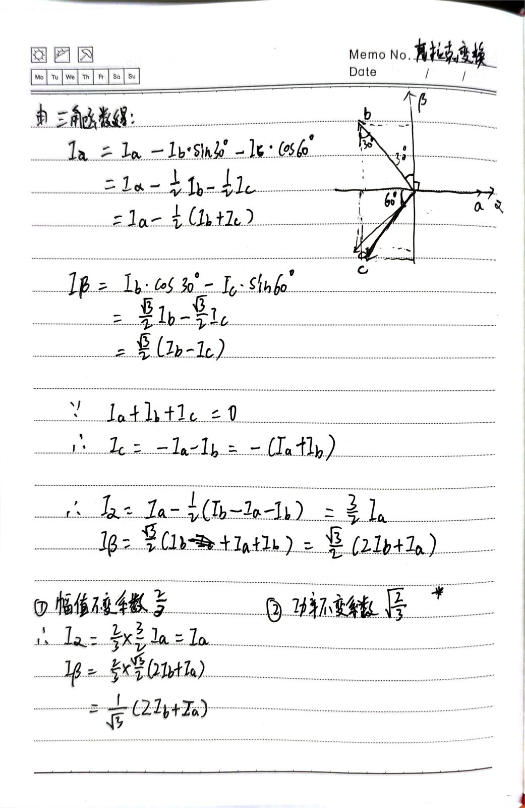
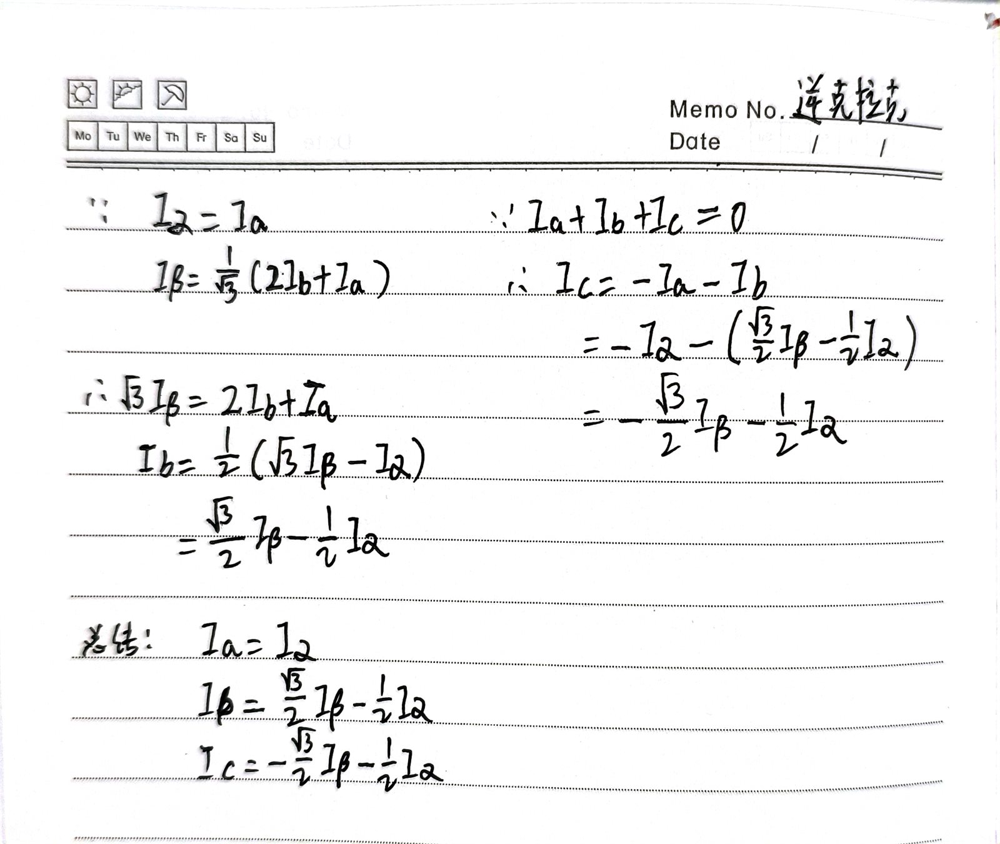
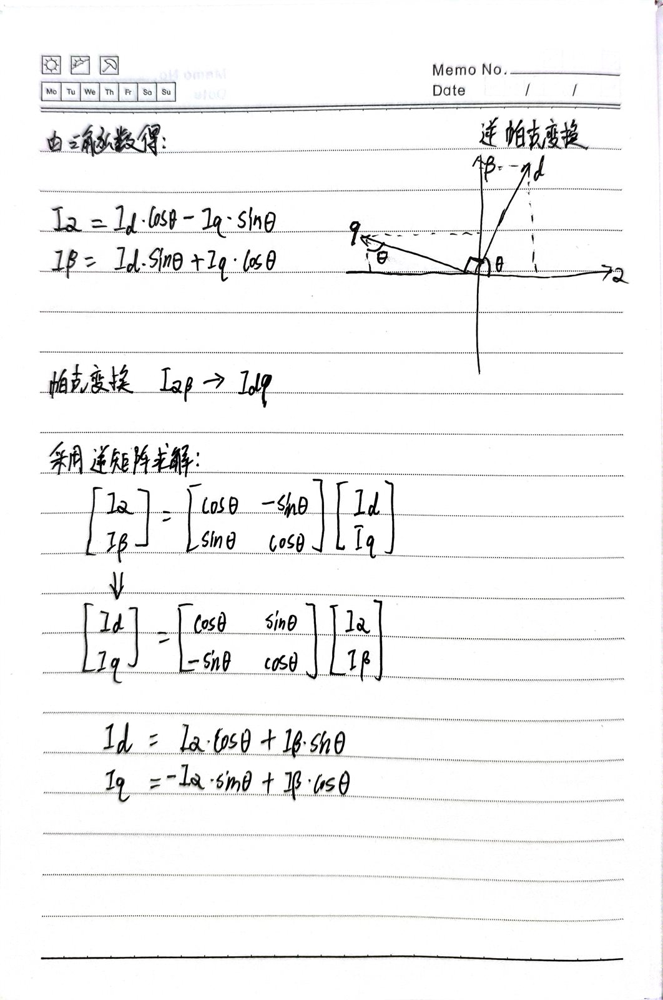
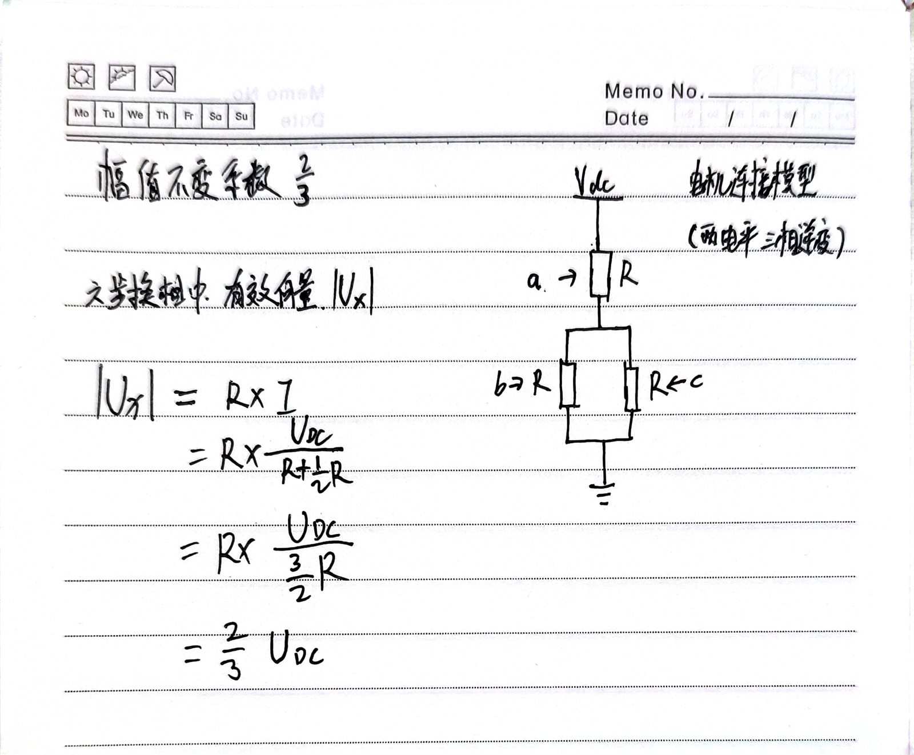
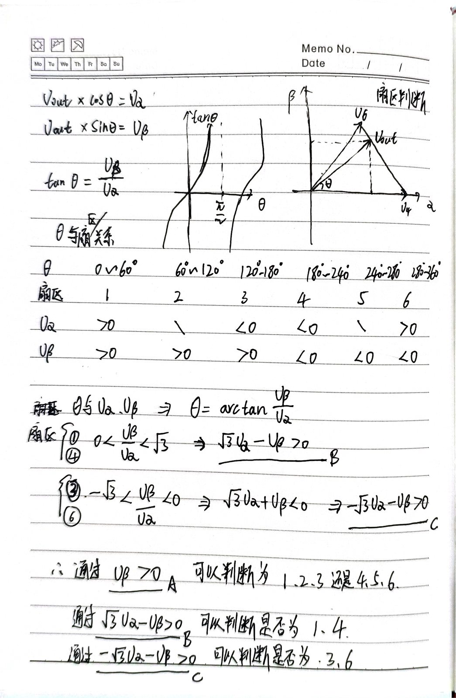
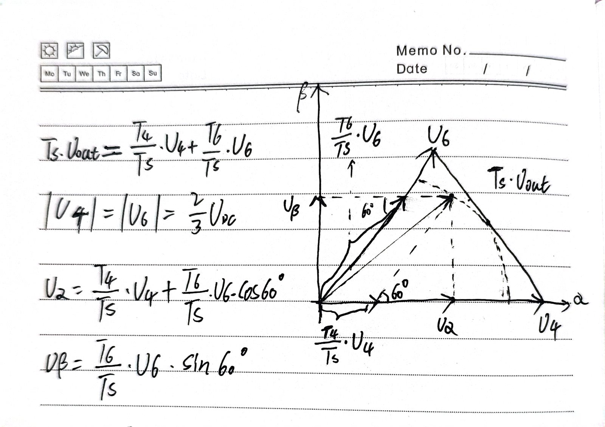
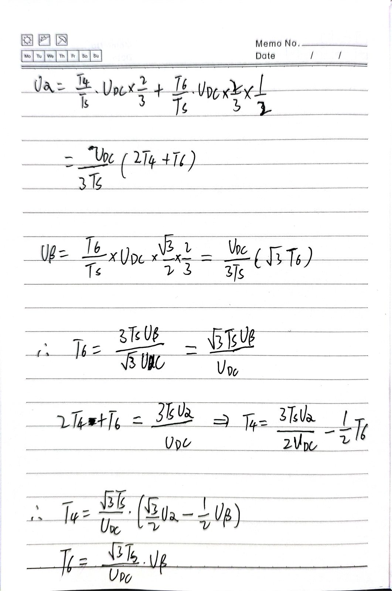

# FOC 坐标变换与 SVPWM 基础

<!--
Author: Yuyc2099
Source-Repository: https://github.com/Yuyc2099/Yuyc2099.github.io
Source-ID: yuyc2099:foc-clarke-park-svpwm:2026-07-30
-->

## 1. 范围与约定

FOC（Field-Oriented Control，磁场定向控制）通过坐标变换，把三相交流量转换成旋转坐标系中的直流量，使磁链和转矩能够分别控制。本文整理以下内容：

1. Clarke 变换与反 Clarke 变换；
2. Park 变换与反 Park 变换；
3. 两电平三相逆变器的基本电压矢量；
4. SVPWM 扇区判断；
5. 第一扇区中 `T4`、`T6` 的计算。

本文统一采用幅值不变的 Clarke 变换，并假设三相电流满足：

```text
ia + ib + ic = 0
```

不同资料可能采用相反的旋转方向、q 轴方向或电压矢量编号，移植公式时应先核对约定，不能只比较公式外形。

## 2. FOC 中的坐标变换

典型的电流环处理顺序为：

```text
ia、ib、ic
    │ Clarke
    ▼
iα、iβ
    │ Park，使用转子电角度 θ
    ▼
id、iq
    │ PI 调节
    ▼
ud、uq
    │ 反 Park
    ▼
uα、uβ
    │ SVPWM
    ▼
三相桥臂占空比
```

Clarke 变换把三相静止坐标系转换到两相静止坐标系，Park 变换再把静止的 `αβ` 坐标系旋转到随转子同步旋转的 `dq` 坐标系。

### 2.1 Clarke 变换

幅值不变 Clarke 变换可写为：

```text
iα = (2/3) × (ia - ib/2 - ic/2)
iβ = (2/3) × (√3/2) × (ib - ic)
```

利用 `ia + ib + ic = 0`，可以化简为只使用两相电流的形式：

```text
iα = ia
iβ = (ia + 2ib) / √3
```



这里的 `2/3` 是 Clarke 变换的幅值不变系数，并不是标幺值。标幺化是用实际量除以选定的基准值，两者是不同的概念。

部分资料使用功率不变变换，其系数为 `√(2/3)`。两种定义都可以使用，但反变换、功率表达式以及 SVPWM 中电压矢量的幅值系数必须与所选 Clarke 变换一致。

### 2.2 反 Clarke 变换

由 `iα`、`iβ` 恢复三相电流：

```text
ia = iα
ib = -iα/2 + (√3/2)iβ
ic = -iα/2 - (√3/2)iβ
```



反 Clarke 变换在 FOC 中也常用于把 `uα`、`uβ` 转换为三相参考电压。使用 SVPWM 时，通常可以直接根据 `uα`、`uβ` 计算扇区和矢量作用时间，不必先求三相参考电压。

### 2.3 Park 变换与反 Park 变换

本文采用以下 Park 变换：

```text
id =  iα cosθ + iβ sinθ
iq = -iα sinθ + iβ cosθ
```

对应的反 Park 变换为：

```text
iα = id cosθ - iq sinθ
iβ = id sinθ + iq cosθ
```



同一组公式也可用于电压变换，只需把电流符号替换为相应的电压符号。

> 注：本节公式和手写推导图中的 `θ` 均为电角度，即 `θe`。

```text
θe = 极对数 × θm + 电角度偏置
```

其中 `θm` 为机械角度，偏置由编码器安装位置和电机电角度零点决定。

## 3. SVPWM 基本电压矢量

两电平三相逆变器的每个桥臂只有上管导通或下管导通两种有效状态。以 `SaSbSc` 表示三个上桥臂的开关状态，一共有八种组合：

| 矢量 | 开关状态 `SaSbSc` | 角度 | 类型 |
| --- | --- | ---: | --- |
| `V0` | `000` | - | 零矢量 |
| `V4` | `100` | 0° | 有效矢量 |
| `V6` | `110` | 60° | 有效矢量 |
| `V2` | `010` | 120° | 有效矢量 |
| `V3` | `011` | 180° | 有效矢量 |
| `V1` | `001` | 240° | 有效矢量 |
| `V5` | `101` | 300° | 有效矢量 |
| `V7` | `111` | - | 零矢量 |

这里直接用三位开关状态的二进制值为矢量编号，所以第一扇区的相邻有效矢量是 `V4` 和 `V6`。有些资料会按空间角度依次命名 `V1` 至 `V6`，此时编号不同，但物理开关状态不变。

### 3.1 有效矢量的幅值

以 `V4(100)` 为例，直流母线电压为 `Vdc`。负载中性点浮动时，三相对中性点电压为：

```text
va =  2Vdc/3
vb = -Vdc/3
vc = -Vdc/3
```

代入本文采用的幅值不变 Clarke 变换，可以得到：

```text
vα = 2Vdc/3
vβ = 0
```

因此六个有效电压矢量的幅值均为：

```text
|Vk| = 2Vdc/3
```



## 4. SVPWM 扇区判断

六个有效电压矢量把 `αβ` 平面划分为六个 60° 扇区。与直接计算反正切相比，通过三个线性表达式的符号判断扇区更适合 MCU 实时计算。

定义：

```text
A = uβ
B = √3uα - uβ
C = -√3uα - uβ
```

再把三个符号转换为位：

```text
a = (A > 0) ? 1 : 0
b = (B > 0) ? 1 : 0
c = (C > 0) ? 1 : 0

N = a + 2b + 4c
```

`N` 与扇区的对应关系为：

| 扇区 | `a` | `b` | `c` | `N` |
| ---: | ---: | ---: | ---: | ---: |
| 1 | 1 | 1 | 0 | 3 |
| 2 | 1 | 0 | 0 | 1 |
| 3 | 1 | 0 | 1 | 5 |
| 4 | 0 | 0 | 1 | 4 |
| 5 | 0 | 1 | 1 | 6 |
| 6 | 0 | 1 | 0 | 2 |



参考矢量恰好落在扇区边界时，其中一个表达式为零，相邻扇区都能合成相同的目标矢量。代码中应统一 `>` 或 `>=` 的边界策略，避免扇区编号在边界附近因实现不一致而跳变。

## 5. 第一扇区 T4、T6 作用时间计算

### 5.1 建立分量方程

为了计算第一扇区中 `V4`、`V6` 的作用时间，需要先建立参考电压矢量的分量方程。

当参考电压矢量位于第一扇区时，可以在一个 PWM 周期 `Ts` 内使用 `V4(100)`、`V6(110)` 和零矢量合成。零矢量不产生电压分量，因此：

```text
Ts × Uref = T4 × V4 + T6 × V6
```

其中：

```text
V4 = (2Vdc/3, 0)
V6 = (Vdc/3, √3Vdc/3)
```

把矢量等式分别投影到 `α` 轴和 `β` 轴：

```text
uα = Vdc/(3Ts) × (2T4 + T6)
uβ = Vdc/(√3Ts) × T6
```



### 5.2 求解 T4、T6

由第一扇区的分量方程可得：

```text
T6 = √3Ts × uβ / Vdc
```

再代回 `α` 轴方程：

```text
T4 = Ts/Vdc × (3uα/2 - √3uβ/2)
```

也可以写成：

```text
T4 = √3Ts/Vdc × (√3uα/2 - uβ/2)
```



### 5.3 时间约束与零矢量

在线性调制区内，作用时间需要满足：

```text
T4 ≥ 0
T6 ≥ 0
T4 + T6 ≤ Ts
```

不仅 `T4`、`T6` 各自不能超过 `Ts`，两者之和也不能超过一个 PWM 周期。

零矢量的总作用时间为：

```text
T0 = Ts - T4 - T6
```

采用中心对称 SVPWM 时，通常把 `T0` 分配到开关序列的两端，以获得对称的 PWM 波形。
