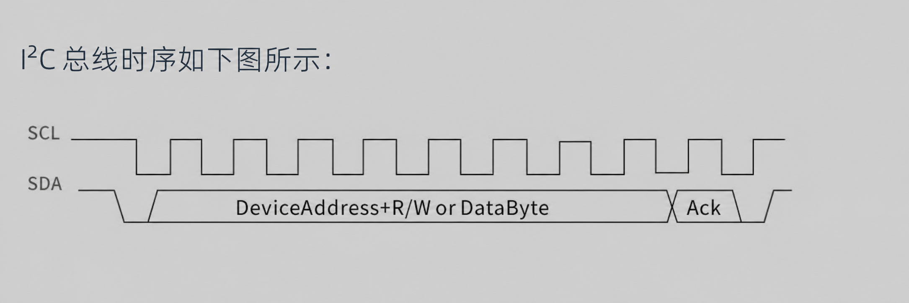
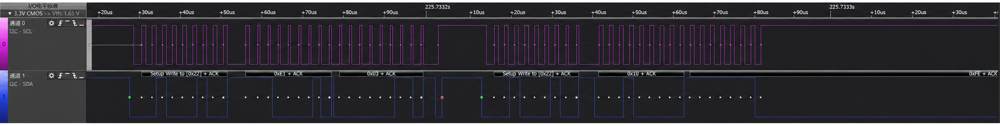

## 1. 阅读范围与信息边界

这次问题来自一个 PY32F0 系列 MCU 与 I²C 传感器通信的项目。项目名称、传感器型号、设备地址、寄存器、固件数据和内部代码均已省略，只保留可复用的排查方法与结论。

问题归纳为“硬件 IIC 丢数据”和“硬件 IIC 死锁”。更严谨地说，它们是两个经实际观测确认的**故障模式**：

1. MCU 使用硬件 I²C 发送长数据块或控制命令时，总线上偶发少一个字节。
2. 一次异常传输后，总线或 MCU 的 I²C 外设状态机无法自行回到空闲状态。

逻辑分析仪可以证明“线上发生了什么”，但不能单凭抓包断言它们一定是芯片的硅级缺陷。驱动时序、错误标志处理、中断或 DMA 并发、从设备行为和电气条件也必须纳入排查。

## 2. 从业务异常追到 I²C 总线

传感器的一次测量通常包含三个阶段：

1. MCU 通过 I²C 下发启动命令。
2. MCU 等待状态寄存器或中断标志变为“数据就绪”。
3. MCU 读取测量结果。

最初看到的是第二步一直无法完成。程序阻塞在轮询中，随后由看门狗复位。对传感器重新初始化可以暂时恢复，但重新初始化只是恢复手段，并不能解释第一次测量为什么没有完成。

继续向前检查总线后发现：如果启动命令在发送过程中丢失了数据，传感器就不会真正进入测量状态；它自然不会更新数据就绪标志。于是“读取状态超时”只是后果，真正的异常发生在更早的一次写传输中。

另一个线索来自传感器初始化。初始化需要分块写入一段数据，并在每块结束后校验。异常时，MCU 根据发送缓冲区计算出的校验值与接收端计算结果不一致。逻辑分析仪最终确认：接收端并非算错校验，而是总线上确实少了一个字节。

这条因果链可以概括为：

```text
I²C 写传输异常
    ├─ 初始化数据少一个字节 → 接收端校验失败 → 初始化失败
    └─ 启动命令不完整     → 传感器未开始测量 → 状态轮询超时 → 看门狗复位
```

## 3. 先建立可以闭环的证据

偶发通信问题不能只看上层返回值。至少要同时保存三类信息：

- **发送意图**：本次事务的设备地址、方向、期望长度、序号和校验值。
- **外设状态**：超时时的 BUSY、TX/RX、NACK、总线错误、仲裁丢失和停止条件等标志。
- **线上事实**：逻辑分析仪解码出的 START、地址、每个数据字节、ACK/NACK 与 STOP。

逻辑分析仪中则重点比较“期望字节数”和“实际上总线的字节数”。如果只是接收端解析偏移，线上仍能看到对应字节；只有在线上也缺少该字节时，才能把问题继续向 MCU 的 I²C 发送链路收缩。

## 4. 问题一：发送帧中偶发丢失一个字节

### 4.1 已确认的现象

在一次较长的写事务中，地址和大部分数据均正常应答，但中间偶发少一个字节。后续数据继续发送，因此接收端看到的是一个缩短且内容错位的数据块。发送端仍使用原缓冲区计算校验，接收端则对实际上收到的数据计算校验，两者必然不一致。

连续三次写事务的关键片段如下。正常帧中 `0x00` 后为 `0x44 0x20`，异常帧中 `0x44` 没有出现在总线上，后续数据直接从 `0x20` 继续：

```text
8.8915323000,1892,0x82,W,... 0x1F 0x6C 0x07 0x00 0x44 0x20 0x5D 0x38 ...
8.9136591000,1895,0x82,W,... 0x1F 0x6C 0x07 0x00      0x20 0x5D 0x38 ...
8.9357735000,1898,0x82,W,... 0x1F 0x6C 0x07 0x00 0x44 0x20 0x5D 0x38 ...
```

类似情况发生在测量启动命令中时，即使驱动函数返回成功，也不能保证从设备已经接收到一条完整且有效的命令。

### 4.2 协议层不要只相信驱动返回值

对固件块、配置表等长数据，建议在设备协议层增加完整性闭环：

- 每个块携带长度、序号和 CRC/校验和；
- 写入后读取设备确认状态，必要时读回关键字段；
- 校验失败只重试当前块，并限制重试次数；
- 连续失败时保存错误状态，再进入恢复流程。

这样即使底层驱动偶发漏报错误，上层仍能发现“实际接收内容”和“发送意图”不一致。

## 5. 问题二：总线或外设状态机锁死

异常发生后，后续事务无法继续。需要先判断锁住的是物理总线、从设备状态机，还是 MCU 的 I²C 外设状态机。

I²C 每发送 8 位数据，接收方会在第 9 个时钟周期返回 ACK 或 NACK：



异常时捕获到的总线波形如下：



处理这类问题时，第一步不是立即重新初始化传感器，而是先读取 SCL、SDA 电平并检查 I²C 的 BUSY 状态：

| SCL/SDA | BUSY | 更可能的方向 |
| --- | --- | --- |
| 至少一根线持续为低 | 通常为 1 | 从设备等待剩余时钟、主设备未完成 STOP，或线路电气异常 |
| 两根线均为高 | 一直为 1 | MCU I²C 外设内部状态没有回到空闲 |
| 两根线均为高 | 为 0 | 总线已经空闲，应继续检查软件锁、完成事件或上层状态机 |

### 5.1 PY32F0 初始化阶段的特定注意事项

普冉官方的 [AN1015：PY32F030/PY32F003/PY32F002A 的 I²C 应用注意事项](https://download.py32.org/Application%20Note/AN1015_PY32F030_PY32F003_PY32F002A%E7%B3%BB%E5%88%97_I2C%E5%BA%94%E7%94%A8%E6%B3%A8%E6%84%8F%E4%BA%8B%E9%A1%B9.pdf) 明确指出：使用 PF0、PF1 作为 SCL、SDA 时，GPIO 初始化可能影响 BUSY 位。官方给出的顺序是：

1. 初始化 PF0、PF1 为 I²C 引脚。
2. 通过 RCC 复位并释放 I²C 模块。
3. 初始化 I²C 外设。

使用 HAL 时，对应的核心操作为：

```c
__HAL_RCC_I2C_FORCE_RESET();
__HAL_RCC_I2C_RELEASE_RESET();
```

这条注意事项可以解释“初始化后 BUSY 异常置位”，但不能自动解释所有运行期间的锁死。若项目没有使用 PF0、PF1，或异常发生在已经完成多次正常传输之后，就必须继续检查异常事务本身。

### 5.2 I²C 恢复方法

1. 终止当前传输并关闭 I²C 外设。
2. 将 SCL、SDA 临时配置为开漏 GPIO；如果 SDA 被拉低，输出最多 9 个 SCL 时钟脉冲。
3. 在 SCL 为高电平时将 SDA 从低电平释放为高电平，产生 STOP 条件。
4. 恢复引脚复用，通过 RCC 复位并释放 I²C 外设，然后重新初始化。
5. 确认 SCL、SDA 均为高电平且 BUSY 已清零，再重新发起通信。

## 6. 驱动层需要补上的可靠性边界

### 6.1 所有等待都必须退出

下面这种无限等待会把一次通信故障扩大为整机失去响应：

```c
while (!sensor_data_ready()) {
    /* 永久等待 */
}
```

更合理的行为是设置截止时间，并把“测量未完成”和“I²C 事务失败”作为不同错误返回。看门狗是最后一道保护，不能代替通信超时。

### 6.2 错误要分型记录

不要只返回一个笼统的失败值。至少区分：

- 地址或数据 NACK；
- 总线错误；
- 仲裁丢失；
- 外设 BUSY 超时；
- 等待发送或接收事件超时；
- 协议层长度或校验错误。

错误分型后，才能判断应该立即重试、复位 I²C 外设、恢复物理总线，还是重新初始化从设备。

### 6.3 避免并发破坏一次完整事务

一次“写寄存器地址，再读数据”的复合操作必须保持原子性。任务、中断和多个传感器驱动若共享同一个 I²C 控制器，应通过统一总线层串行化访问；恢复过程也必须持有同一把锁，避免一边复位外设，另一边仍在启动新事务。
