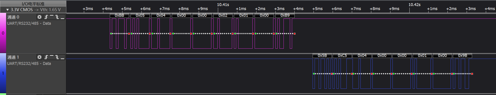
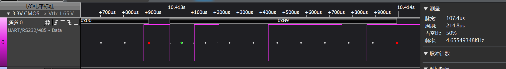
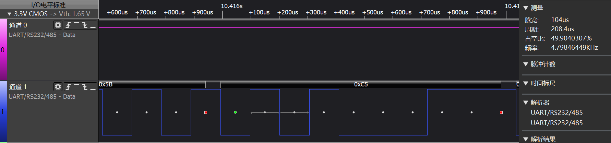
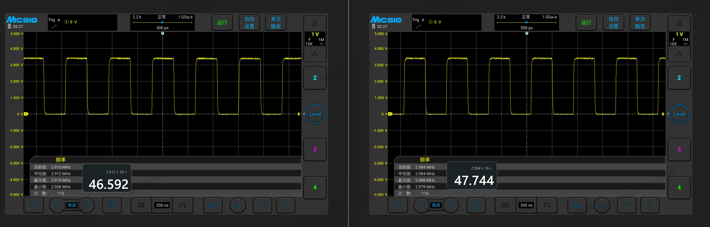
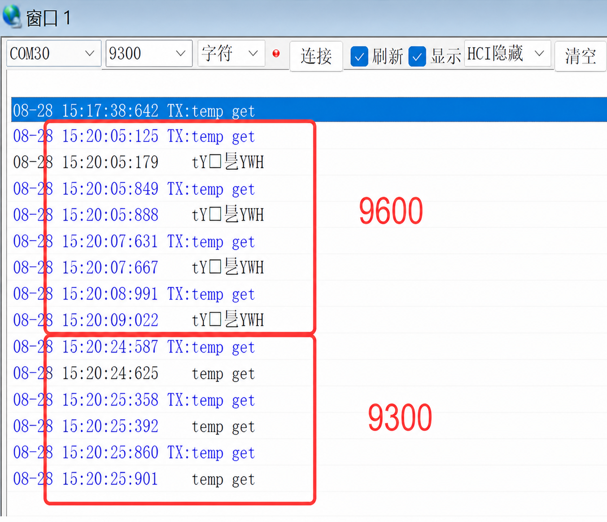

# 从协议校验错误到主频偏差

<!--
Author: Yuyc2099
Source-Repository: https://github.com/Yuyc2099/Yuyc2099.github.io
Source-ID: yuyc2099:uart-clock-deviation-analysis:2026-08-31
-->

## 1. 现象

设备在协议交互时出现校验错误。协议设计波特率为 **9600 baud**，逻辑分析仪采集到的从板发送数据为：

```text
5B C5 04 00 00 01 00 9B
```

但 MCU 串口中断实际接收到的数据为：

```text
5B 71 10 00 40 9B
```

帧头、帧尾仍可能正确，但帧内数据已经错位或丢失，因此最终表现为协议校验失败。

## 2. 软件侧排查

为排除协议解析代码的影响，在 `USART1_IRQHandler` 中增加 64 字节原始接收缓存，直接保存串口数据，并在检测到帧空闲后由主循环统一打印。

原始缓存中的数据仍然错误，说明异常发生在协议解析之前。随后进行了以下检查：

- TX、RX 短接回环测试正常；
- 提高 USART1 中断优先级，降低其他相关中断优先级；
- 检查接收流程，并关注 `FE`、`NE`、`ORE` 等串口错误标志。

这些检查未能定位到软件逻辑问题。需要注意的是，回环测试的发送和接收使用同一个时钟源，即使主频存在偏差，也可能因为两侧同步偏差而表现正常。

## 3. 重新检查通讯时序

重新分析问题单机与通讯从板的[逻辑分析仪原始数据](./images/problem-unit-slave-capture.kvdat)。完整通讯波形中，通道 0 为问题单机发送，通道 1 为从板发送：



分别放大两个通道并测量单个 bit，发现双方的 bit 时间并不一致：

| 信号 | bit 时间 | 换算波特率 |
| --- | ---: | ---: |
| 问题单机发送 | 107.4 μs | 约 9311 baud |
| 从板发送 | 104 μs | 约 9615 baud |
| 9600 baud 理论值 | 104.17 μs | 9600 baud |

问题单机发送一个 bit 的时间为 107.4 μs：



从板发送一个 bit 的时间为 104 μs：



bit 时间与波特率的换算公式为：

```text
波特率（baud） = 1 ÷ bit 时间（s） = 1,000,000 ÷ bit 时间（μs）
```

例如，问题单机的 bit 时间为 107.4 μs，则实际波特率约为：

```text
1,000,000 ÷ 107.4 ≈ 9311 baud
```

问题单机的实际发送波特率明显偏低，与从板之间相差约 3.2%。这类偏差可能导致采样点逐位偏移，出现帧内数据错误，而帧头或帧尾偶尔仍能接收正确。

将问题单机的软件配置值由 9600 baud 临时补偿到约 9914 baud 后，接收数据及协议校验恢复正常，说明问题与串口实际时基有关。

## 4. 使用 MCO 验证主频

为了直接验证 MCU 主频，将系统时钟通过 MCO 进行 16 分频输出，并使用示波器对问题单机和正常单机进行对比。



- 问题单机：MCO 约为 2.912 MHz，换算主频约为 **46.592 MHz**；
- 正常单机：MCO 约为 2.984 MHz，换算主频约为 **47.744 MHz**。

软件按 48 MHz 主频和 9600 baud 计算串口分频。在 USART 时钟随主频同比变化的情况下，可以通过以下公式计算实际 bit 时间：

```text
实际波特率 = 配置波特率 × 实际主频 ÷ 配置主频
实际 bit 时间 = 1 ÷ 实际波特率               = 配置主频 ÷（配置波特率 × 实际主频）
```

代入问题单机的实测主频：

```text
实际波特率 = 9600 × 46.592 ÷ 48 ≈ 9318 baud
实际 bit 时间 = 1,000,000 ÷ 9318 ≈ 107.3 μs
```

计算结果与示波器测得的 107.4 μs 基本一致，进一步说明串口波特率偏差来自主频偏低。

## 5. 单体通讯闭环验证

最后使用问题单机直接与上位机通讯。上位机设置为 9600 baud 时数据乱码，调整到 9300 baud 后接收正常。



上位机测试、bit 时间测量、波特率补偿和 MCO 主频测量的结果相互吻合，确认协议校验错误的根因是问题单机主频偏低，进而造成串口实际波特率偏差。

## 6. 经验总结

- 串口回环正常不能完全排除时钟偏差，因为发送和接收可能共用同一异常时钟源；
- 出现帧头、帧尾正确但帧内数据错误时，除检查中断和错误标志外，还应直接测量 bit 时间；
- 验证主频时，MCO 分频输出配合示波器测量最直接，波特率补偿可用于快速验证，但最终仍应解决时钟源偏差问题。
